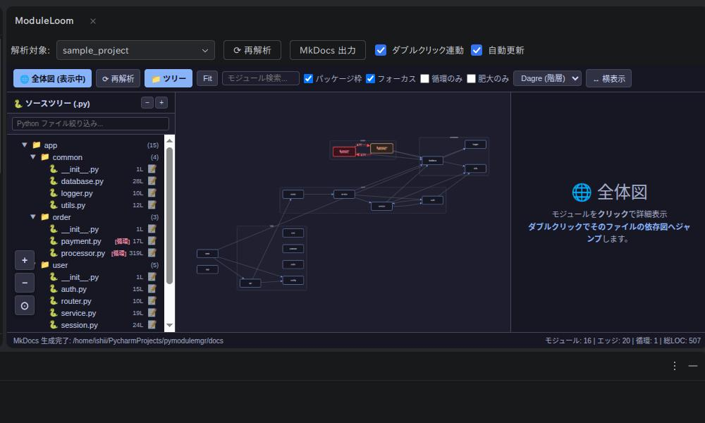
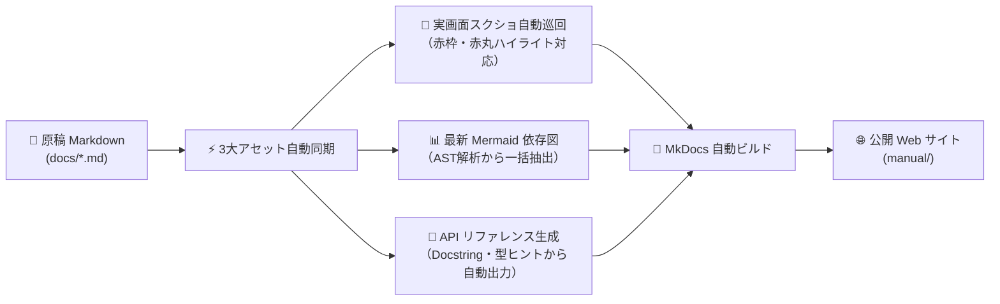

# ModuleLoom



Python モジュールの依存関係、循環インポート、肥大化を可視化する統合開発支援ツールです。デスクトップアプリ、PyCharm プラグイン、VS Code 拡張機能、および CLI を別々に配布します。

### 🌟 3 つの主要機能
1. **🔍 モジュール依存関係 & 循環インポートのリアルタイム可視化**: 複雑なパッケージ構造や循環インポートの代表経路を即座に特定し、エディタ連携でワンクリック修正。
2. **📖 3大アセット自動同期ドキュメント生成 & AI連携（目玉機能）**: 原稿内の画像・Mermaid図・APIリファレンスをボタン1発で自動同期。実画面の自動巡回撮影（赤枠・赤丸ハイライト対応）やDocstringからのMkDocs生成、ローカルAI CLI連携を完全統合。
3. **🚨 コード品質・アーキテクチャ診断**: 循環、肥大化、重複コード（jscpd同梱）、型注釈欠落を多角的に診断し、検出したコーディングエージェントへ診断スキルを自動導入。

画面の **表示 → 言語** で日本語・英語を切り替えられます。初回は環境の言語を使い、選択内容を保存します。

## PyCharm からデスクトップ版を起動

Node.js と Rust を用意して、このリポジトリで一度 `npm ci` を実行してください。その後、PyCharm で [main.py](main.py) を開き、行番号横の実行ボタンを押すとデスクトップ版が起動し、`sample_project` を初期解析します。別の対象を使う場合は、PyCharm の実行構成の「パラメータ」にプロジェクトのパスを指定します。相対パスはこのリポジトリを基準に解決します。スクリプトはリポジトリを作業ディレクトリにして `npm run app` を実行します。

## GitHub からインストール

[Releases](https://github.com/tamon-ishii/module_loom/releases) から使用する版のファイルを選んでください。

| 用途 | ダウンロードするファイル | インストール |
| --- | --- | --- |
| PyCharm | `ModuleLoom-PyCharm-*.jar` | 設定 → プラグイン → 歯車 → **Install Plugin from Disk** |
| VS Code | `ModuleLoom-VSCode-*.vsix` | 拡張機能画面の `…` → **Install from VSIX** |
| Windows デスクトップ | `ModuleLoom-Desktop-windows-x64-*.exe` | インストーラーを実行 |
| Linux デスクトップ | `ModuleLoom-Desktop-linux-x64-*.AppImage` または `.deb` | AppImage を実行、または deb をインストール |
| macOS デスクトップ | `ModuleLoom-Desktop-macos-*-*.dmg` | CPU に合う `x64` または `arm64` の DMG を開く |

PyCharm と VS Code の配布ファイルには、対応する OS の解析用実行ファイルを同梱しています。解析 CLI を単独で使う場合は `ModuleLoom-CLI-*.zip` を選んでください。展開すると `moduleloom-analyze`（Windows は `.exe`）、`jscpd`、ライセンス、診断スキルの `SKILL.md` が入っています。同じディレクトリに置いたままCLIを実行すると、重複診断に同梱の jscpd を使います。現在の対象は Windows と Linux の x64、macOS の x64 と arm64 です。

PyCharm・VS Code・デスクトップ版とCLIの配布ファイルには jscpd v5 を同梱し、コード診断の重複検出に使います。jscpd の MIT ライセンス全文と著作権表示は配布物内の `licenses/jscpd/LICENSE` に含まれます。Lizard、ty、Ruff は解析対象の環境または `PATH` にある場合に使い、Lizard がなければ関数複雑度は組み込みのAST推定値になります。元のライセンス文は [third_party/jscpd/LICENSE](third_party/jscpd/LICENSE) に保存しています。

コード診断画面の「コード診断スキルをインストール」を押すと、この端末で検出した Codex、Claude Code、Cursor に [ModuleLoom 診断スキル](skills/moduleloom-diagnostics/SKILL.md) を導入します。CLI では `moduleloom-analyze --install-skill` で同じ操作ができます。各エージェントの設定ディレクトリまたは実行コマンドを検出し、スキルをユーザー用の `skills/moduleloom-diagnostics` に保存します。Codex は `CODEX_HOME` が設定されていればそこを使います。既存のスキルの内容が異なる場合は上書きせず、その保存先を表示します。スキルの認識にはエージェントの再起動が必要になる場合があります。

## リリースの作成

`main` へのプッシュと手動実行では、ビルド結果を GitHub Actions の成果物として保存します。`v` で始まるタグをプッシュすると、3種類の配布ファイルと解析 CLI を GitHub Releases に公開します。

```sh
git tag v1.1.0
git push origin v1.1.0
```

タグの版は `src-tauri/tauri.conf.json` と `plugins/vscode/package.json`、`package.json`、`pyproject.toml`、`crates/analyzer/Cargo.toml` の版に合わせてください。

## プロジェクトごとの解析設定

解析対象プロジェクトの直下に `moduleloom.toml` を置くと、肥大化警告の閾値を変更できます。設定ファイルがない場合は、LOC 300、関数 20、クラス 10 が使われます。

```toml
[thresholds]
max_loc = 500
max_functions = 30
max_classes = 15
max_cyclomatic_complexity = 10
```

アーキテクチャルールも設定できます。`forbidden` は依存禁止、`independence` は相互依存禁止、`layers` は上位レイヤーから下位レイヤーへの一方向依存を検査します。`protected` は指定モジュールの import 元を許可リストに制限し、`acyclic_siblings` は同じ親の直下にあるパッケージ間の循環を検査します。`ignore_imports` に指定した辺はルール検査から除外し、一致しなくなった例外は違反として報告します。`*` は１階層、`**` は任意の深さに一致します。

```toml
[architecture.forbidden.api_db]
source = "app.api"
target = "app.db"

[architecture.independence.web_domain]
modules = "app.web, app.domain"

[architecture.layers.app]
layers = "app.presentation, app.application, app.domain, app.infrastructure"
closed = ["app.application"]

[architecture.protected.internal]
module = "app.internal"
allowed = ["app.api", "app.tests.*"]

[architecture.acyclic_siblings.features]
parent = "app.features"

[architecture]
ignore_imports = ["app.legacy -> app.internal"]
```

`closed` に挙げた層を飛ばして、その下の層を上位層から直接 import すると違反になります。例外は `source -> target` の形式で、モジュール名にワイルドカードを使えます。

依存宣言と import の食い違いも検査します。DEP001（未宣言）、DEP002（未使用）、DEP003（推移的依存の直接利用）、DEP004（開発用依存の本番利用）、DEP005（標準ライブラリの宣言）を解析結果へ含めます。対象は `requirements.txt` / `requirements.in` とその `-r` 参照、`requirements-dev.txt` / `dev-requirements.txt`、`pyproject.toml` の標準依存・任意依存・dependency groups・Poetry 依存、および `uv.lock` です。任意依存は未使用でも DEP002 にしません。dependency groups は開発用依存として扱います。開発用コードは `tests` / `test` / `testing` ディレクトリと、`test_*.py` / `*_test.py` / `conftest.py` / `noxfile.py` / `toxfile.py` で判定します。import 名と配布パッケージ名が異なる場合や意図的な依存は次の設定で調整できます。

```toml
[dependencies]
ignore = ["pytest"]

[dependencies.import_map]
google = "google-cloud-storage"
```

設定を変更した後は、次回の解析または自動更新時から反映されます。

デスクトップ版は「自動更新」がオンの間、OS のファイル変更通知で対象プロジェクト内の Python ファイルと `moduleloom.toml` を監視します。PyCharm プラグインもツールウィンドウの「自動更新」がオンの間、保存・追加・削除後に再解析します。VS Code 拡張はグラフを開いている間、自動で更新します。連続した変更は短時間まとめて処理し、変更された Python ファイルだけを読み直してから依存関係を再計算します。設定ファイルやフォルダ構成の変更時は全体を再解析します。

CI では `--check` を付けると、解析できなかった Python ファイル、アーキテクチャルール違反、または依存宣言の問題がある場合に終了コード 1 になります。循環と肥大化も失敗条件にする場合は、それぞれ `--check-cycles`、`--check-bloat` を指定します。両方含める場合は `--check-all` を使います。これらのオプションは単独でも `--check` と同じ基本検査を行います。

解析結果にはシンボル、関数呼び出し、循環依存、未使用候補、複雑度、結合度、セキュリティ診断、パッケージ依存も含まれます。モジュール詳細の「コールグラフを表示」から、選択モジュールに関係するシンボル呼び出しを確認できます。ノードのダブルクリックで定義位置を開けます。

「コード診断」タブの「総合複雑度」は 0～100 の見直し目安です。循環・相互 import を含むモジュールと結合度（35%）、肥大化モジュールの割合（25%）、関数数あたりの分岐の複雑さ（20%）、重複行の割合（20%）から計算します。値が高いほど確認を勧めます。各内訳と優先候補を表示し、候補を押すと依存図へ移動できます。通常解析では、連続する 6 行の一致のうち、import・関数定義などの定型行を除いて5行以上の処理がある箇所を候補として表示します。診断実行時は jscpd v5 により、識別子を変えた類似コードも検出します。文字列の値まで変えたコードは対象外です。生成コードのディレクトリと生成を示すヘッダーを持つファイルは重複検出から除外します。行番号からエディタで確認できます。解析できなかったファイルは集計に含まれないため、解析エラーも確認してください。

「モジュール一覧」と「コード診断」はタブで切り替えます。モジュール画面ではソースツリーとモジュール詳細の境界をドラッグして幅を変えられます。変更した幅は次回も保持されます。コード診断タブの「診断実行」は詳細解析を明示的に実行します。ファイル変更時の自動更新は通常のモジュール解析で、詳細診断はボタンから再実行します。実行中表示の後、総合複雑度の内訳、優先候補、重複箇所、マジックナンバー、重複リテラルを表示し、検出箇所からエディタへ移動できます。分岐の複雑さは [Lizard](https://github.com/terryyin/lizard)、重複コードは [jscpd](https://jscpd.dev/)、比較式に含まれるマジックナンバーは [Ruff の PLR2004](https://docs.astral.sh/ruff/rules/magic-value-comparison/) を使用します。重複リテラルは ModuleLoom が Python の構文木から、8文字以上の文字列または `0`・`1` 以外の数値が3回以上出現する候補を検出します。マジックナンバーはすべての数値リテラルを対象にするものではありません。Lizard または jscpd が利用できない場合は ModuleLoom の推定値に戻し、画面とJSONに採用した解析器を記録します。外部ツールは解析対象プロジェクトの `.venv` / `venv`、`node_modules/.bin`、または `PATH` から検索します。

診断実行後は「コピペ・関数化候補」に jscpd v5 の一致箇所を行範囲付きで表示します。検出条件は 6 行・30 トークン以上で、完全一致と識別子だけが異なる類似構造を区別します。10 行以上の一致は共通関数化の検討候補として示します。候補が関数内にある場合は、関数名、引数と戻り値の型注釈の差を表示します。関数化の可否は処理内容を確認して判断してください。jscpd v5 が見つからない場合は組み込みの重複検出に戻ります。

型チェックには [ty](https://docs.astral.sh/ty/) を使用します。解析対象プロジェクトの環境に `ty` をインストールすると、「診断実行」で型エラーを検出し、コード診断と問題一覧にファイル・行番号付きで表示します。`--quality --json` および `--quality-report` にも結果が含まれます。`ty` がない場合は外部ツールの警告に表示します。型注釈の欠落は ty 自体の対象外なので、従来どおり ModuleLoom の簡易検出で表示します。

```bash
uv sync --group dev
moduleloom-analyze --quality-report ./my-project > quality-report.json
moduleloom-analyze --quality-report --max-score 40 ./my-project
```

`--quality-report` はAIやCI向けの要約JSONを標準出力に出します。総合複雑度と内訳、解析器、優先モジュールと行番号、重複箇所、リテラル検出、循環・設計違反・依存宣言の問題・解析エラーを含みます。全モジュールの解析結果が必要なら `--quality --json` を使用します。`--max-score N` は詳細診断を実行して総合複雑度が N を超えたとき終了コード1にします。スコアは見直しの目安なので、閾値はプロジェクトに合わせて設定してください。

`--diagnostics` は `--quality-report` の別名です。AI向けの `findings` に、複雑度超過、重複、型チェック、リテラル、アーキテクチャ、依存宣言、解析エラーを同じ形式で含めます。各指摘には照合用ID、規則、重要度、解析元、ファイルと行、根拠、提案、再診断用の規則名が入ります。関数ごとの循環的複雑度は `max_cyclomatic_complexity` を超えると警告になります。Lizard が使える場合はその値を、使えない場合は組み込みのAST推定値を使用し、`source` に記録します。`complexity.function_complexities` にはしきい値以下も含む全関数の値が入ります。

```bash
moduleloom-analyze --diagnostics ./my-project > diagnostics.json
moduleloom-analyze --diagnostics --findings-only --max-ccn 8 --rule 'complexity/*' ./my-project
```

`--max-ccn` は今回の実行だけしきい値を上書きします。`--rule` は繰り返し指定でき、末尾の `*` で規則の前方一致を選べます。`--findings-only` はAI向けに統一指摘とツール警告だけを返します。`findings` はエラー、警告、情報の順に並び、型注釈欠落の簡易推定は情報として扱います。通常の診断JSONには従来の `duplicate_candidates` と `diagnostics` も残し、前者には各候補のファイル・行範囲・最大30行のコード片・関数名・シグネチャを含めます。

循環インポートでは実在する代表経路と import 行を表示します。改善候補は、型注釈のみの直接参照、実行時の参照、判定できない参照を区別します。候補は確認の起点であり、複数の経路を持つ循環では1か所の変更だけで解消しない場合があります。

デスクトップ版では「修正ツール」で外部ツールを選べます。標準の Ruff は、型注釈専用と判定した改善候補に対して TC001 の差分を提示します。差分を確認してから適用し、循環を再解析します。Ruff はプロジェクトの `.venv` / `venv` または `PATH` にインストールしてください。TC001 は import の実行時期を変える可能性があり、Ruff では unsafe fix に分類されています。

ほかの修正ツールは `moduleloom.toml` へ登録できます。次の例の `tools/fix-cycle` はユーザーが用意する実行ファイルです。

```toml
[fix_tools.my_fixer]
label = "My fixer"
command = "tools/fix-cycle"
preview_args = ["--diff", "{file}", "{source}", "{target}", "{line}"]
apply_args = ["--write", "{file}", "{source}", "{target}", "{line}"]
kinds = ["type_only", "runtime", "unknown"]
```

プレビュー用コマンドはファイルを変更せず、差分を標準出力へ出してください。適用用コマンドは修正を書き込みます。引数はシェルを経由せずに渡され、作業ディレクトリはプロジェクトのルートです。`{project}` も引数に使えます。適用前には対象ファイルとプレビュー差分が変わっていないことを確認します。独自ツールが対象ファイル以外も編集する場合は、表示された差分の範囲を確認してください。

「解析データを JSON で保存」では、現在の解析結果全体を保存できます。VS Code / PyCharm 版は解析対象の `.moduleloom`、デスクトップ版はダウンロード先に保存します。解析結果はプロジェクトごとに最大 20 件までブラウザ内へ保存され、任意の 2 件を選ぶ履歴比較とシンボル・依存関係の削除候補比較に使われます。保存容量が足りない場合は古い履歴から減らします。

「変更ファイルを強調」では、作業中の変更か指定した 2 つのコミット間の変更を選び、該当する Python ファイルを依存図上で強調します。修正したモジュールがどこにあり、周囲にどんな依存関係があるかを確認するときに使います。コードの行単位の差分や、変更による影響範囲を自動判定する機能ではありません。「問題一覧」には依存宣言の問題も含まれます。import 経路検索では、解析済みモジュールを出発点と到着点に選びます。

## 📖 3大アセット自動生成ドキュメントエンジン & AI連携（目玉機能）


ModuleLoom の **「ドキュメント生成」** は、手書きマニュアル内の **スクリーンショット、Mermaid モジュール依存図、および Docstring からの API リファレンス** という、手作業での更新が最も負担となる **3 大アセットの自動同期・一括生成** に特化したハブ機能です。

### 💡 なぜこの機能が目玉なのか？
従来の開発現場では、UI の改修やコードの変更があるたびに：
- 「画面キャプチャを撮り直して手作業で切り抜く」
- 「アーキテクチャ図や Mermaid の矢印を手書きで修正する」
- 「関数の引数・戻り値や Docstring の変更をドキュメントへ転記する」
といった膨大なメンテナンス作業が発生し、ドキュメントの陳腐化を招いていました。

ModuleLoom では、原稿 Markdown 内の `<!-- ai:task -->` を同期ポイントとして配置しておくだけで、**ボタン 1 発で実画面の自動巡回キャプチャ、AST 解析からの最新ダイアグラム生成、および Docstring からの API リファレンス出力** を自動実行します。



### 🌟 3 大アセット自動生成の詳細

#### 1. 📸 実画面スクショの自動巡回撮影 & アノテーション合成
- **全画面の自動巡回キャプチャ**: 「📸 全スクショ一括撮影」ボタンを押すだけで、ツールが各タブ（モジュール一覧、コード診断、ドキュメント生成など）を自動巡回し、原稿内の全画像を最新の実際の描画から一括撮影・差し替えます。
- **「赤丸」「矢印」「説明文ラベル」の自動合成**:
  - 指示文または「💬 修正指示」に要素名やセレクタを指定し、「赤丸」「矢印」「『...』と説明」と指示するだけで、対象要素の周囲に **赤丸（円形）** や **角丸赤枠** を描き、**赤い指示矢印** と **スタイリッシュな吹き出し説明文ラベル** を自動合成してキャプチャします。画像編集ソフトによる切り抜きや矢印入れの手作業が一切不要になります。
- **サムネイル一覧プレビュー & リテイク特化**:
  - カード内に撮影された最新画像のサムネイルが並び、クリックで拡大プレビューが可能。
  - 面倒な承認ボタンの個別押しは不要で、画像が存在していればそのまま完成版ビルドを通せます。撮り直したい画像だけピンポイントに「💬 修正指示」でリテイク可能です。

#### 2. 📊 最新モジュール依存図（Mermaid）の自動同期
- 原稿内に `<!-- ai:task kind=diagram -->` を置いておくだけで、「📊 全ダイアグラム更新」を押すたびに、コードベースの最新 AST から抽出された Mermaid ダイアグラムへと自動置換されます。

#### 3. 📖 Docstring からの完全な API リファレンス自動生成
- 「📖 APIドキュメント生成」を実行すると、プロジェクト内の全 Python モジュールを走査し：
  - 各モジュールの詳細ページ（`docs/modules/*.md`）: クラス、メソッド、関数、引数型、Docstring、個別 Mermaid 依存図
  - 全体 API カタログ（`docs/api.md`）: 全シンボルの目次と説明一覧
  を Markdown 原稿内にミリ秒で自動出力します。

---

### 🤖 ローカル認証済み AI CLI（Codex, Claude, Grok, Agy）とのシームレス連携
- **API キー不要**: 端末にインストール済みの各 CLI（Codex, Claude Code, Grok Build, Agy）の既存ログイン状態を使用します。
- **ハッシュ追跡と承認保護**:
  - 各生成ブロックには指示文の SHA-256 ハッシュ値（`source-sha256`）が記録され、原稿の指示が書き換えられた場合は自動的に「指示変更あり（stale）」と検知されます。
  - 「承認」を行うと承認日時が記録され、不用意な再生成から保護されます。

### ⚙️ 出力先・原稿元の一元管理（設定ポップアップ）
ヘッダーの **「⚙️ 設定」** ボタンをクリックすると、専用の設定ポップアップが開き、以下の設定をスマートに管理できます：
- **🌐 HTML 出力先ディレクトリ**: MkDocs が完成版静的サイトを出力するパス（既定値: `manual`）
- **📝 Markdown 原稿元ディレクトリ (MDファイル元)**: 原稿の `.md` ファイルが配置されているパス（既定値: `docs`）
- **対象プロジェクト**: 解析対象の Python プロジェクトパス
- **AI CLI & モデル**: 使用する AI CLI の切り替えやモデル ID の指定、利用可能モデル候補の取得
- **MkDocs サイト設定**: サイト名、テーマ（material / mkdocs / readthedocs）、言語、URL形式

### 💻 デスクトップ版・PyCharm・VS Code 全環境で完全同等
ドキュメント生成機能は、デスクトップアプリ（Tauri）、PyCharm プラグイン、VS Code 拡張機能、CLI のすべてで完全に同等に実装されています。どの環境からでも同じ操作でドキュメントの自動同期が可能です。

### AI タグの書き方とルール仕様

原稿 Markdown 内に埋め込む `<!-- ai:task -->` および生成される `<!-- ai:generated -->` タグの厳格な構文と運用ルールです。コーディングエージェントや人間がマニュアル原稿を作成する際は、以下のルールに従ってください。

#### 1. タスク指示タグの基本構文 (`ai:task`)

```markdown
<!-- ai:task id=<一意のID> kind=<screenshot|diagram|text>
<指示文 / プロンプト>
-->
```

- **`id` の命名規則**: 小文字英字で始まり、小文字英数字とハイフンのみ使用可能（`^[a-z][a-z0-9-]*$`）。原稿全体で一意（重複不可）。
- **`kind` の種別（3 種類のみ）**:
  - `screenshot`: 実画面のキャプチャ画像専用（`` を出力）。
  - `diagram`: Mermaid によるモジュール依存図専用（```mermaid ... ``` を出力）。
  - `text`: 文章、解説、手順、注釈専用。
- **改行・フォーマットルール**: タグ開始直後に必ず改行して指示文を開始し、末尾も改行して `-->` で閉じます。空の指示文は構文エラーになります。

#### 2. 単一責任の原則（Strict Separation）

各 `kind` の生成物は、その目的以外の不要な要素（注釈や出典、説明文）を含めてはなりません。
- **`screenshot`**: **純粋な画像タグのみ**（``）。画像タグの前後に説明文・注釈・出典を含めないでください。説明が必要な場合は、直前または直下に別の `kind=text` タスクを独立して配置します。
- **`diagram`**: **純粋な Mermaid コードブロックのみ**。出典やフッター注記を含めないでください。
- **`text`**: **文章・手順・注釈専用**。画像タグや Mermaid コードブロックを混在させず、純粋な説明文のみを生成させます。

#### 3. スクリーンショットのアノテーション指示仕様（赤丸・角丸赤枠・矢印・説明文ラベル）

指示文または GUI の「💬 修正指示」に要素名やキーワード、アノテーション指示を含めることで、撮影時に自動で **赤丸・角丸赤枠**、**指示矢印**、および **吹き出し説明文ラベル** を合成できます：

```
       ┌─────────────────────────────────────┐
       │ 💬 1. ここをクリックして全スクショ更新 │  ← 吹き出し説明文ラベル（半透明ダーク背景・赤枠）
       └──────────────────┬──────────────────┘
                          ▼                         ← 指示矢印（赤色ハイライト）
                   ╭─────────────╮
                   │ 📸 全スクショ │                  ← 赤丸 または 角丸赤枠ハイライト
                   ╰─────────────╯
```

##### アノテーション指示の構文キーワード
| 指定項目 | 指示方法 | 動作仕様 |
| :--- | :--- | :--- |
| **対象要素** | `#btn-id`, `.class` またはボタン名<br>（例: `全スクショ`, `ダイアグラム`, `API`, `ビルド`, `保存`, `解析`, `診断`, `設定` 等） | 指定された ID/クラス、または自然言語のボタン名に一致する UI 要素を自動検出します。 |
| **ハイライト形状** | `丸`, `円`, `circle` を含む | **円形（赤丸）** で要素を包み込むようにハイライトします（指定がない場合はフィットする **角丸四角の赤枠**）。 |
| **指示矢印** | `矢印` または `arrow` を含む | 要素の直上（またはスペースに応じて直下）に **赤い指示矢印（`⬇` / `⬆`）** を合成します。 |
| **説明文ラベル** | `「...」`, `『...』`, `"..."`, `'...'`, または `説明: ...` | 赤枠・矢印と合わせて、ダーク半透明背景に赤枠の **吹き出し説明文ラベル** を自動配置します。 |

##### 実践的な活用例

- **活用例 1: 操作手順マニュアルで重要ボタンを赤枠・矢印・吹き出しで案内**
  ```markdown
  <!-- ai:task id=step-batch-capture kind=screenshot
  #btn-manual-batch-capture を赤枠で囲み、矢印を付けて「1. ここをクリックして全スクショを一括更新」と説明
  -->
  ```
  *効果*: ボタンが角丸赤枠で強調され、その真上に矢印と「1. ここをクリックして全スクショを一括更新」のラベルが付いた画像がワンクリックで撮影・保存されます。

- **活用例 2: 設定アイコンを赤丸と矢印で注目させる**
  ```markdown
  <!-- ai:task id=settings-guidance kind=screenshot
  設定ボタンを赤丸と矢印で指して「出力先やAIモデルを変更」と説明
  -->
  ```
  *効果*: 設定アイコンが綺麗な赤丸でマークされ、矢印と説明ラベルが付加されるため、読者が一目で操作場所を理解できます。

- **活用例 3: GUIの「💬 修正指示」からの即座リテイク**
  - ドキュメント生成カード内の「💬 修正指示」モーダルで：
    > 「保存ボタンを赤丸で囲み、矢印をつけて『変更をプロジェクトに保存』と説明文を入れて」
  - と入力して送信するだけで、指示通りのアノテーションが合成された新しい画像に即座に差し替わります。


#### 4. 生成後タグ (`ai:generated`) とライフサイクル

- タスクが実行・撮影されると、原稿内の `ai:task` は自動的に `<!-- ai:generated id=... created-at=... source-sha256=... -->` に置き換わります。
- **`source-sha256`**: 指示文の SHA-256 ハッシュ値を記録し、指示文が後から書き換えられた場合に自動的に「指示変更あり（stale）」と検知します。
- **`approved-at`**: 内容を確認して「承認」を行うと承認日時が記録され、不用意な再生成から保護されます（Mermaid 図はコード最新状態を反映するため承認済みでも再生成可能）。
- **下書きビルド（`--draft`） vs 完成版ビルド**: 下書きビルドでは未解決タスクをオレンジ色の「作成待ち」プレースホルダーとして可視化し、完成版ビルドでは全タスクの完了を厳格に検証します。

### CLI によるマニュアル操作とピンポイント修正指示

GUI だけでなく、ターミナルから `moduleloom-analyze --manual` を使って状況確認や自然言語での修正指示を行えます：

```sh
# 1. タスク一覧と状態の確認（JSON出力）
moduleloom-analyze --manual scan --root ./my-project

# 2. 自然言語によるピンポイント修正指示・再生成（タグIDを指定）
moduleloom-analyze --manual generate-task --root ./my-project --id pycharm-open-tool-window --feedback "初心者向けにメニューの場所をより具体的に箇条書きで解説して"

# 3. スクリーンショットの登録
moduleloom-analyze --manual record-screenshot --root ./my-project --id overview-screenshot --image ./path/to/screenshot.png

# 4. 下書きビルド（未完了箇所を「作成待ち」としてプレビュー生成）
moduleloom-analyze --manual build --root ./my-project --draft

# 5. 完成版ビルド（全タスク完了が必須）
moduleloom-analyze --manual build --root ./my-project

# 6. タスクの承認（変更ロック）
moduleloom-analyze --manual approve --root ./my-project --id pycharm-open-tool-window
```

デスクトップ版または PyCharm プラグインの「MkDocs 出力」、あるいは CLI の `--mkdocs` で、全体依存図、モジュール別ページ、API 一覧ページを含む MkDocs プロジェクトを生成できます。各モジュールページにはモジュール・クラス・関数・メソッドの docstring と、クラスの基底クラス、呼び出し可能オブジェクトの引数・既定値・型注釈・戻り値注釈を掲載します。Google、NumPy、Sphinx 形式の docstring 見出しも Markdown に整えます。ソースコード本文は出力しません。PyCharm とデスクトップ版は生成先・モジュール数・言語を確認してから生成します。

表示言語は `auto`（マシンのロケールから自動選択）、`ja`、`en`、`fr`、`de`、`es`、`zh`、`ko`、`pt` を指定できます。PyCharm では出力時に選択し、CLI では `--lang` で指定します。

```sh
moduleloom-analyze --mkdocs ./moduleloom-docs ./my-project
# 日本語で生成する場合
moduleloom-analyze --mkdocs ./moduleloom-docs --lang ja ./my-project
cd moduleloom-docs
mkdocs serve
```

生成した `mkdocs.yml` は Material for MkDocs と Mermaid 用に設定されています。表示には `mkdocs-material` が必要です。Mermaid の JavaScript とライセンス表示は生成先に同梱するため、図はオフラインでも表示できます。翻訳カタログは解析器の `mkdocs_i18n.json` で管理します。出力先は空のディレクトリ、または以前 ModuleLoom が生成したディレクトリを指定してください。再生成時は生成ページが更新され、不要になった生成ページは削除されます。

全体図では「外部ノード」でプロジェクト外への import を表示でき、モジュール選択後に「表示範囲」で 1～3 ホップへ絞れます。「集約」は指定件数を超える同一パッケージ内のモジュールを１ノードにまとめ、ダブルクリックで展開できます。「経路検索」は２モジュール間の最短 import 経路を強調表示します。CLI でも `moduleloom-analyze --chain app.api app.db ./my-project` で照会できます（`--json` も併用可能）。

```sh
moduleloom-analyze --check ./my-project
```
