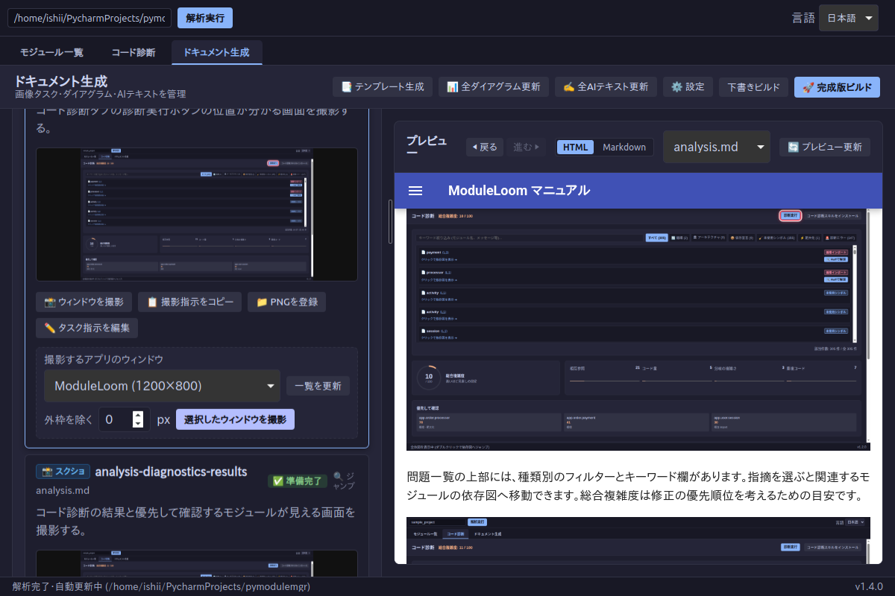
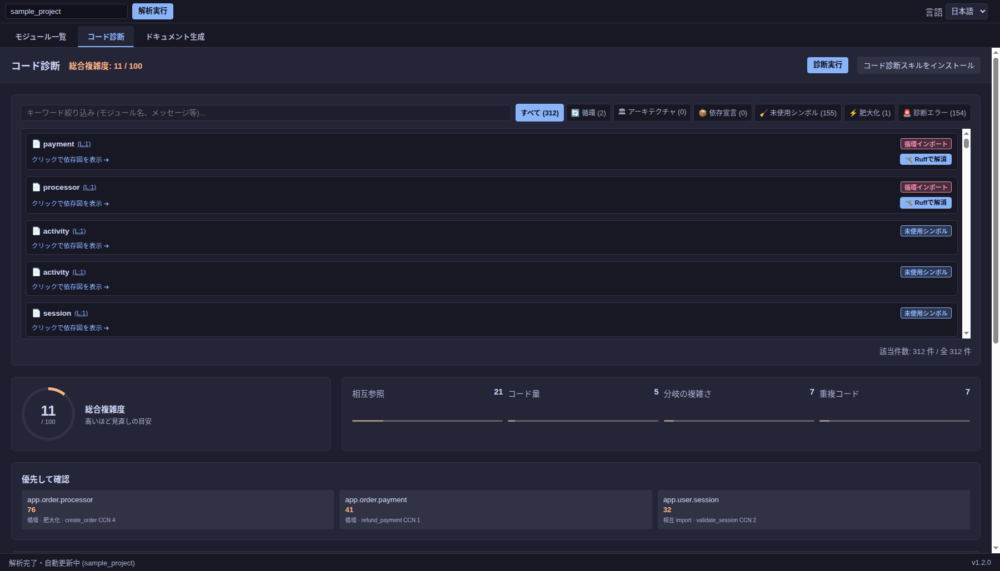
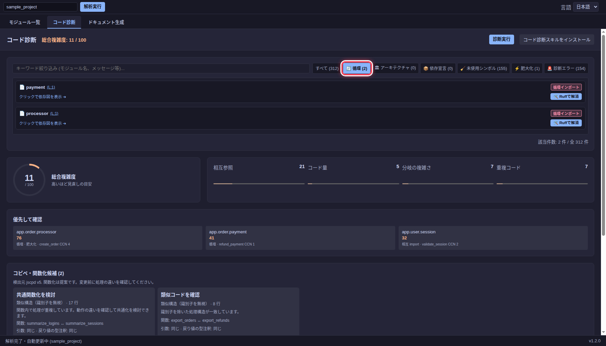

# 循環インポートとコード診断

## 循環インポートを確認する

`sample_project` には `app.order.payment` と `app.order.processor` の循環インポートがあります。依存図では該当ノードと矢印が赤く表示されます。`payment.py` を選ぶと、右側の import 一覧に `processor` への参照と行番号が表示されます。

<!-- ai:task id=analysis-cycle kind=screenshot
payment と processor の循環インポートを依存図で確認できる画面を撮影する。
-->

<!-- ai:generated id=analysis-cycle kind=screenshot prompt-b64=cGF5bWVudCDjgaggcHJvY2Vzc29yIOOBruW+queSsOOCpOODs+ODneODvOODiOOCkuS+neWtmOWbs+OBp+eiuuiqjeOBp+OBjeOCi+eUu+mdouOCkuaSruW9seOBmeOCi+OAgg== source-sha256=0e45d3c6ba1c0b85af9aff306d986da74e1721705d7db7d614637c32a71c2bcc -->

<!-- /ai:generated -->

循環の片方の import だけを変更しても、別の経路が残る場合があります。両ファイルの import 文と実行時の参照を確認し、変更後に再解析してください。

## コード診断を実行する

**コード診断**タブを開き、**診断実行**を押します。結果には循環、肥大化、重複コード、型チェックなどの指摘が表示されます。外部の診断ツールが利用できない項目は、画面の警告を確認してください。

<!-- ai:task id=analysis-run-diagnostics kind=screenshot
コード診断タブの診断実行ボタンの位置が分かる画面を撮影する。
-->

<!-- ai:generated id=analysis-run-diagnostics kind=screenshot created-at=2026-09-29T22:15:52Z source-sha256=c406dbd93a85342e501f25d7a6f7a98e547e220194640c8b46713e5d03b7da9a prompt-b64=44Kz44O844OJ6Ki65pat44K/44OW44Gu6Ki65pat5a6f6KGM44Oc44K/44Oz44Gu5L2N572u44GM5YiG44GL44KL55S76Z2i44KS5pKu5b2x44GZ44KL44CC -->

<!-- /ai:generated -->

問題一覧の上部には、種類別のフィルターとキーワード欄があります。指摘を選ぶと関連するモジュールの依存図へ移動できます。総合複雑度は修正の優先順位を考えるための目安です。

<!-- ai:task id=analysis-diagnostics-results kind=screenshot
コード診断の結果と優先して確認するモジュールが見える画面を撮影する。
-->

<!-- ai:generated id=analysis-diagnostics-results kind=screenshot prompt-b64=44Kz44O844OJ6Ki65pat44Gu57WQ5p6c44Go5YSq5YWI44GX44Gm56K66KqN44GZ44KL44Oi44K444Ol44O844Or44GM6KaL44GI44KL55S76Z2i44KS5pKu5b2x44GZ44KL44CC source-sha256=8bd256b2be678a7de674dadd59adeba018763c32ae3f6ea069eaec8ad44da4f1 -->

<!-- /ai:generated -->

**循環**を選ぶと、循環に関係する指摘だけを表示できます。画像の例では `payment` と `processor` の 2 件が表示されています。

<!-- ai:task id=analysis-cycle-filter kind=screenshot
循環フィルターで診断結果を絞った画面を撮影する。
-->

<!-- ai:generated id=analysis-cycle-filter kind=screenshot prompt-b64=5b6q55Kw44OV44Kj44Or44K/44O844Gn6Ki65pat57WQ5p6c44KS57We44Gj44Gf55S76Z2i44KS5pKu5b2x44GZ44KL44CC source-sha256=0968efdb6f97610e70dbe9bd5721fe39f5264cd921256e9b6d768e773815f51d -->

<!-- /ai:generated -->

修正候補が表示される場合は差分を確認してから適用します。診断結果は候補なので、変更の妥当性はコードとテストで判断してください。修正後は **診断実行**を再度押して結果を確認します。
