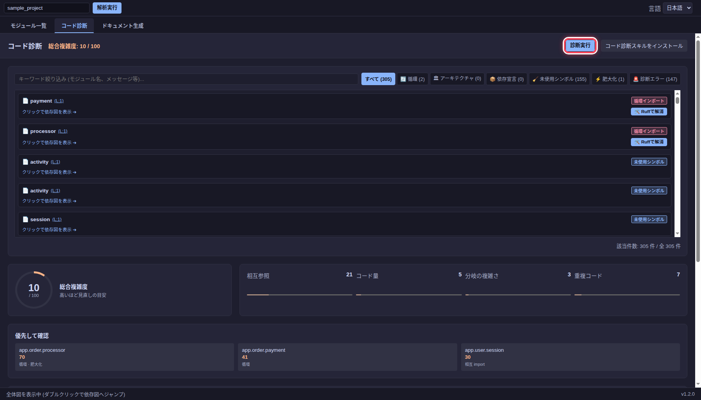

# 循環インポートとコード診断

## 循環インポートを確認する

`sample_project` には `app.order.payment` と `app.order.processor` の循環インポートがあります。依存図では該当ノードと矢印が赤く表示されます。`payment.py` を選ぶと、右側の import 一覧に `processor` への参照と行番号が表示されます。

循環の片方の import だけを変更しても、別の経路が残る場合があります。両ファイルの import 文と実行時の参照を確認し、変更後に再解析してください。

## コード診断を実行する

**コード診断**タブを開き、**診断実行**を押します。結果には循環、肥大化、重複コード、型チェックなどの指摘が表示されます。外部の診断ツールが利用できない項目は、画面の警告を確認してください。

問題一覧の上部には、種類別のフィルターとキーワード欄があります。指摘を選ぶと関連するモジュールの依存図へ移動できます。総合複雑度は修正の優先順位を考えるための目安です。

**循環**を選ぶと、循環に関係する指摘だけを表示できます。画像の例では `payment` と `processor` の 2 件が表示されています。

修正候補が表示される場合は差分を確認してから適用します。診断結果は候補なので、変更の妥当性はコードとテストで判断してください。修正後は **診断実行**を再度押して結果を確認します。
