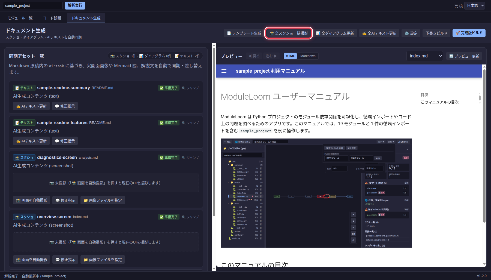

# ドキュメントを生成する

**ドキュメント生成**タブでは、Markdown 原稿と画面画像・依存図を管理し、MkDocs の HTML サイトを出力します。スクリーンショットと Mermaid 図は原稿内のタスクに対応します。

## 原稿と出力先を確認する

**設定**で対象プロジェクト、Markdown 原稿のフォルダー、HTML の出力先を確認します。この例では原稿が `docs/`、出力先が `manual/` です。

<!-- ai:task id=manual-settings kind=screenshot
ドキュメント生成の原稿パスと HTML 出力先の設定画面を撮影する。
-->

<!-- ai:generated id=manual-settings kind=screenshot prompt-b64=44OJ44Kt44Ol44Oh44Oz44OI55Sf5oiQ44Gu5Y6f56i/44OR44K544GoIEhUTUwg5Ye65Yqb5YWI44Gu6Kit5a6a55S76Z2i44KS5pKu5b2x44GZ44KL44CC source-sha256=33cf046d725fa0756cc07d1ce827a1b14debd940ead1a9786c6f7108cf4504c5 -->

<!-- /ai:generated -->

原稿がない場合は **テンプレート生成**から下書きを作れます。既存の原稿がある場合は、その内容を確認してから生成を実行してください。

<!-- ai:task id=manual-template kind=screenshot
テンプレート生成で原稿の種類を選ぶ画面を撮影する。
-->

<!-- ai:generated id=manual-template kind=screenshot prompt-b64=44OG44Oz44OX44Os44O844OI55Sf5oiQ44Gn5Y6f56i/44Gu56iu6aGe44KS6YG444G255S76Z2i44KS5pKu5b2x44GZ44KL44CC source-sha256=fb911cc7ddfb28214133f5c6edf9f8885cc99a84db446ef9ef010c96f442f7f0 -->

<!-- /ai:generated -->

## 画像と図を更新する

原稿にスクリーンショットのタスクがある場合、**全スクショ一括撮影**で現在の画面から画像を撮影します。個別の画像を撮り直す場合は、更新対象アセットの **画面を自動撮影**を使います。操作対象を示したいときは **修正指示**にボタン名や要素 ID と「赤丸で囲む」などを入力して再撮影できます。

<!-- ai:task id=manual-capture-control kind=screenshot
全スクショ一括撮影ボタンの位置が分かる画面を撮影する。
-->

<!-- ai:generated id=manual-capture-control kind=screenshot prompt-b64=5YWo44K544Kv44K344On5LiA5ous5pKu5b2x44Oc44K/44Oz44Gu5L2N572u44GM5YiG44GL44KL55S76Z2i44KS5pKu5b2x44GZ44KL44CC source-sha256=d41eced2ef16857d557608a52962ce86de512630c776d23017d362a4a5ddca96 -->

<!-- /ai:generated -->

依存図のタスクは **全ダイアグラム更新**で更新します。API リファレンスが必要な場合は **API ドキュメント生成**を使い、docstring と型注釈からモジュール別のページを作ります。

## ビルドして確認する

**下書きビルド**は未完成のタスクを残したままプレビューを作ります。右側の **HTML** 表示でページを確認し、画像や文章を直した後に **完成版ビルド**を実行します。完成版ビルドでは、未解決のタスクがあるとエラーになります。

<!-- ai:task id=manual-draft-build kind=screenshot
下書きビルドボタンと HTML プレビューが見える画面を撮影する。
-->

<!-- ai:generated id=manual-draft-build kind=screenshot prompt-b64=5LiL5pu444GN44OT44Or44OJ44Oc44K/44Oz44GoIEhUTUwg44OX44Os44OT44Ol44O844GM6KaL44GI44KL55S76Z2i44KS5pKu5b2x44GZ44KL44CC source-sha256=10e402e8ed5ada7d15ca22f89b4423cdc3683603043c9b24db4dc213183d1d88 -->

<!-- /ai:generated -->

## AI タグの仕様

Markdown 原稿では、生成・撮影・更新する箇所を `ai:task` タグで指定します。タグは HTML コメントなので、生成前の原稿を通常の Markdown 表示にしても指示文は本文に表示されません。

```markdown
<!-- ai:task id=quickstart-guide kind=text
初めて使う人向けに、プロジェクトの指定手順を説明してください。
-->

<!-- ai:task id=overview-shot kind=screenshot
メイン画面を撮影してください。
-->

<!-- ai:task id=module-map kind=diagram
モジュール間の依存関係を図にしてください。
-->
```

`id` はタスクを識別する名前です。省略時は種類・ファイル名などから自動生成されます。明示する場合は小文字英字で始め、小文字英数字とハイフンだけを使います（`^[a-z][a-z0-9-]*$`）。ID はすべての原稿 Markdown ファイルを通じて重複しないようにします。

`kind` は `text`（説明文）、`screenshot`（画面画像）、`diagram`（Mermaid 図）のいずれかです。省略すると `text` として扱われます。タグの開始行の後で改行して指示を書き、終了の `-->` は別の行に置いてください。指示文は空にできません。

種類ごとに生成内容を分けます。`text` には説明文、`screenshot` には画像 Markdown、`diagram` には Mermaid コードブロックだけを置きます。画像の説明や図の注釈が必要な場合は、別の `kind=text` タスクを使います。

生成後も `ai:task` は更新指示として残し、その直下に同じ `id` の `ai:generated` ブロックを置きます。次回の同期では指示を使って回答を更新し、生成ブロックの本文だけを差し替えます。指示や種類が変わると既存の回答は古い状態になります。下書きビルドでは未完了タスクを確認できますが、完成版ビルドには各タスクの最新の回答が必要です。

CLI から既存の Python コードに基づく MkDocs ページだけを生成する場合は、次のコマンドを使用します。

```sh
moduleloom-analyze --mkdocs ./moduleloom-docs ./sample_project
```
