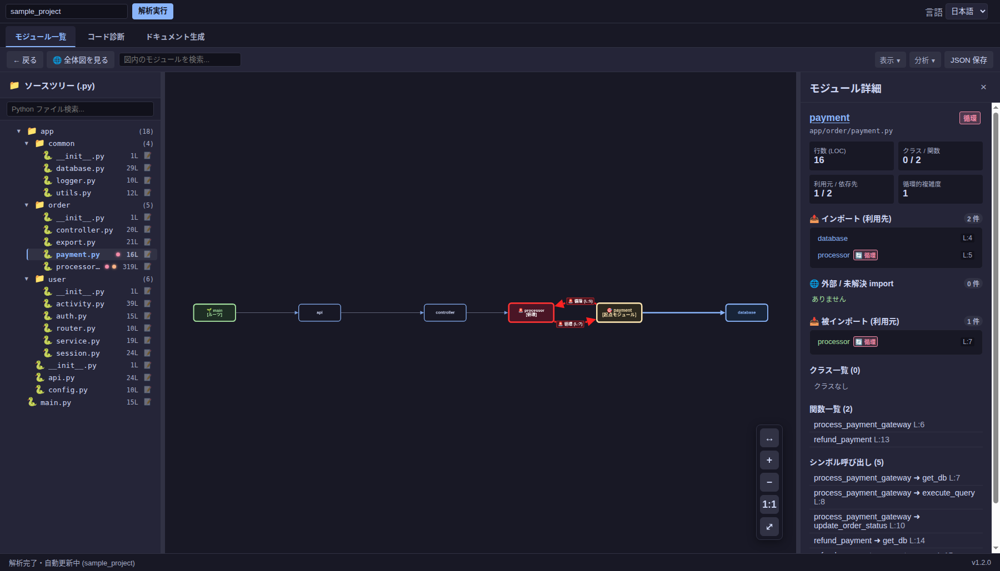
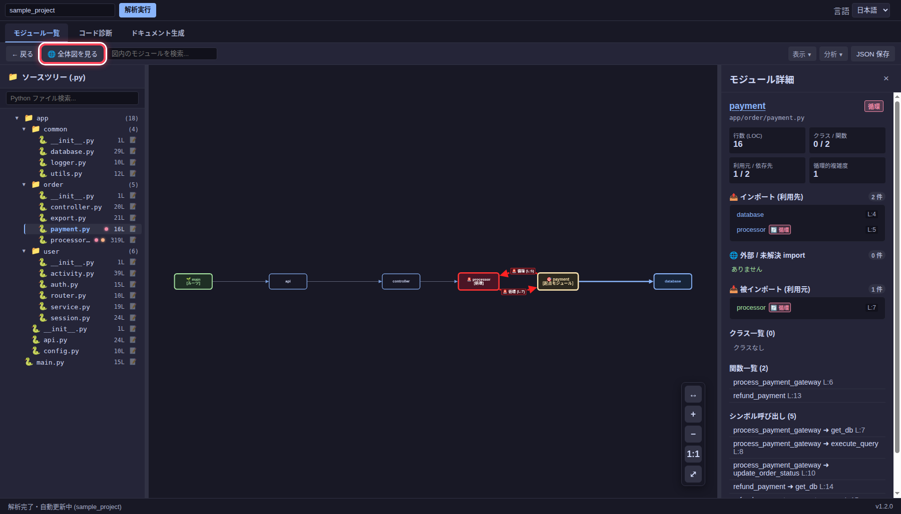
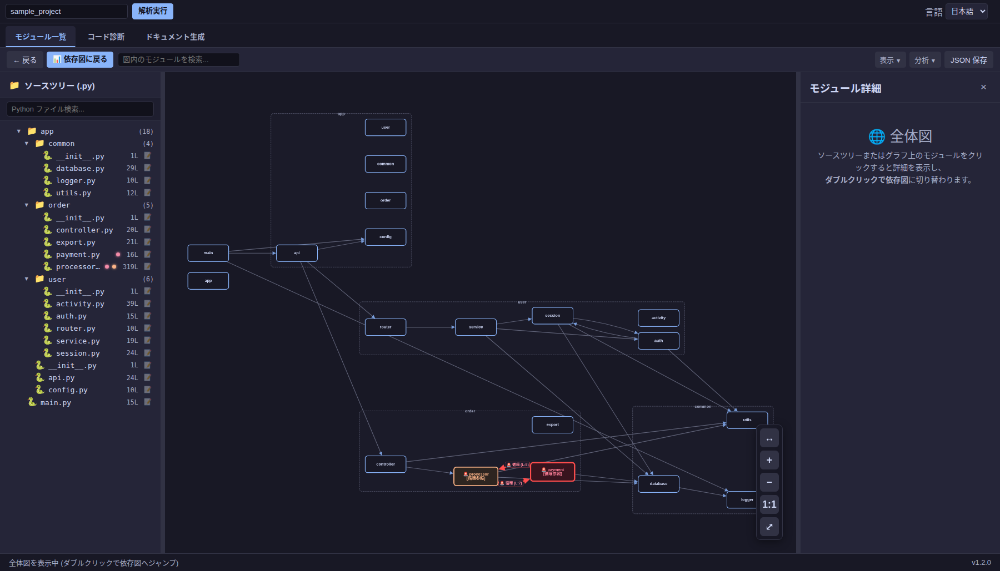

# 解析を始める

## プロジェクトを指定する

デスクトップ版では上部のパス欄に Python プロジェクトのルートを入力し、**解析実行**を押します。PyCharm 版と VS Code 版では、開いているプロジェクトを対象に解析します。

解析が終わると、左に `.py` ファイルのツリー、中央に import の依存図、右に選択したモジュールの詳細が表示されます。

## 依存図を読む

ノードはモジュール、矢印は import の向きを表します。左のツリーで `app/order/payment.py` を選ぶと、右側に行数、関数、import 先と import 元が表示されます。import の行番号から該当コードを確認できます。

**全体図を見る**を押すと、プロジェクト内のモジュールをまとめて表示します。全体図でノードを選ぶと詳細が表示され、ダブルクリックするとそのモジュールを中心とした依存図に切り替わります。

大きいプロジェクトでは、上部の検索欄や **表示** メニューの表示範囲・集約を使って図を絞り込めます。2 モジュール間の import 経路は **分析** メニューの「import 経路検索」で調べられます。
