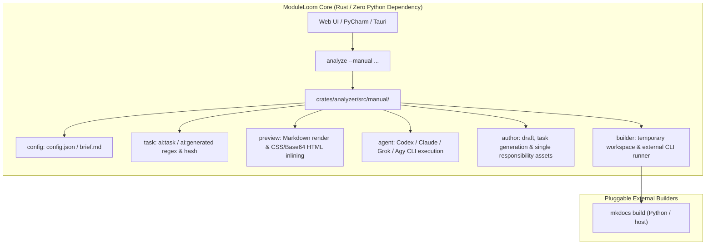

# Design: Native Manual Engine & Batch Screenshot Capture

## Architecture

## Key Components
1. **`crates/analyzer/src/manual/`**:
   - `config.rs`: Safe workspace-relative path resolution, graceful empty brief handling.
   - `task.rs`: SHA-256 instruction hashing, status state machine (`missing`, `current`, `approved`, `stale`).
   - `preview.rs`: HTML inlining of CSS styles and Base64 images for iframe/webview rendering.
   - `agent.rs`: Structured JSON execution across Codex, Claude Code, Grok Build, and Agy.
   - `author.rs`: Prompts enforcing top-page key visuals, pure image outputs, and pure Mermaid fences.
   - `builder.rs`: Dynamically generates `mkdocs.yml` with Mermaid superfences and executes external builder.
2. **Frontend Automation (`src/main.ts`)**:
   - `captureAllScreenshots`: Sequentially activates `modules`, `diagnostics`, and `manual` tabs, captures Cytoscape / DOM elements, saves PNG assets via backend bridge, and recompiles draft HTML.
   - Immediate settings persistence: Saves agent, model, and format to both project `config.json` and `localStorage`.
