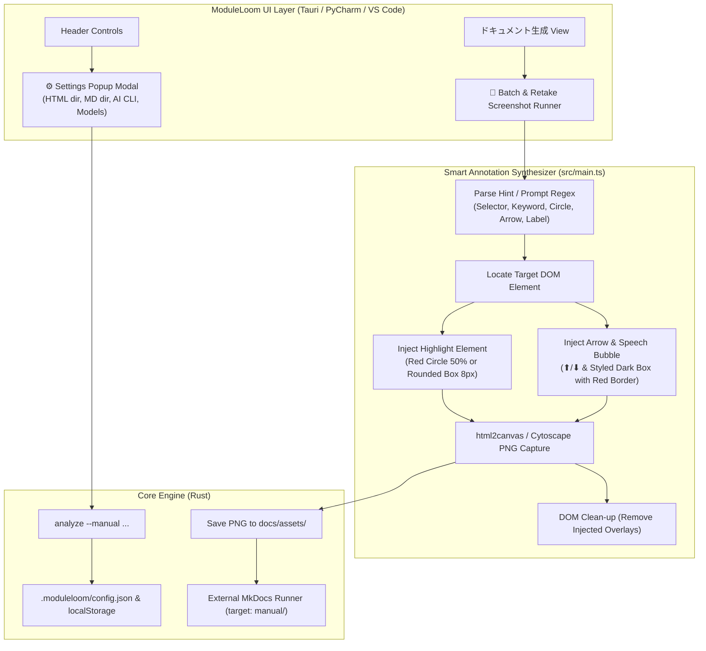

# Design: Smart Annotations, Settings Popup, AI Tag Rules, and Release v1.1.0

## Architecture

## Key Components

1. **Smart Annotation Synthesis (`src/main.ts`)**:
   - `captureBackgroundScreenshot(taskId, annotationHint)`:
     - Extracts selector (`#id`, `.class`) or keyword matches across UI buttons (`全スクショ`, `ダイアグラム`, `API`, `ビルド`, `保存`, `設定`, etc.).
     - Parses shape (`丸`, `円`, `circle`) for `border-radius: 50%` vs default `8px`.
     - Detects `矢印`, `arrow` to render directional `⬇` or `⬆`.
     - Extracts quoted string (`「...」`, `『...』`, `"..."`, `'...'`) or `説明:...` into a styled callout label with dark translucent backdrop and red border.
     - Safely strips injected DOM nodes in a `finally` block before returning the image data URL.

2. **Unified Settings Popup Modal**:
   - Replaced scattered controls with a centralized settings dialog.
   - Distinct fields for HTML output path (default: `manual`) and Markdown source directory (default: `docs`).
   - Persists choices to project configuration and browser storage simultaneously.

3. **Specification & Documentation Alignment**:
   - `README.md`: Key visuals, 3-asset documentation engine breakdown, ASCII art annotation diagram, practical prompt patterns.
   - `documentation-preview.md`: Formalized syntax, single responsibility rules, and build mode distinction.
   - `plugin.xml` & `package.json`: Multilingual plugin descriptions and release notes for IDE marketplaces.
