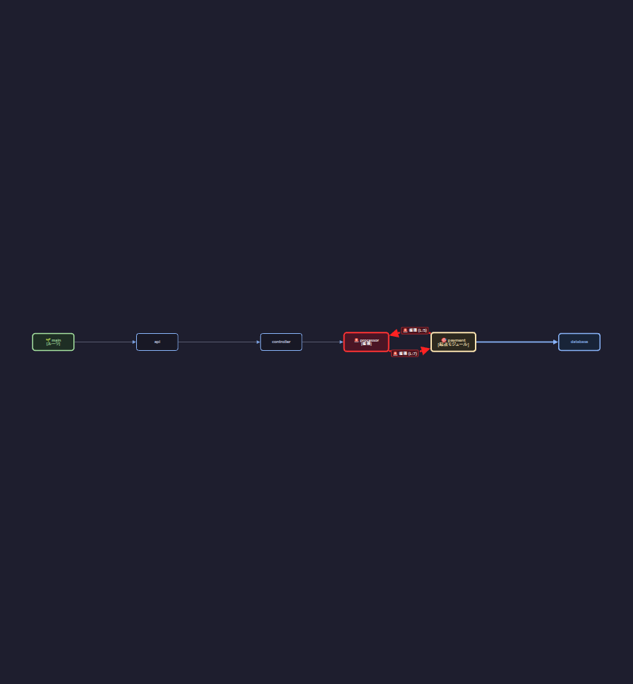
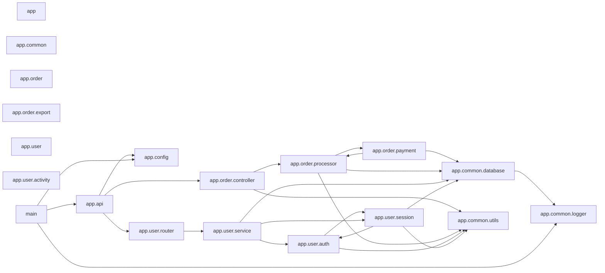

<!-- ai:draft created-at=2026-09-26T10:34:37Z agent=agy brief-sha256=f8d1016d6ffbbb934ee6171d66e53d2b99cf877b245377c3cc4a5acb3a3c12f5 -->
# モジュール依存図を読む

「モジュール一覧」タブでは、Python プロジェクト内のモジュール間の依存・被依存関係をグラフィカルに確認できます。

## 画面構成

- **ソースツリー (.py)**: 左側パネルに Python ファイルの一覧が表示されます。
- **依存グラフ領域**: 中央に Cytoscape による依存関係図が表示されます。
- **モジュール詳細**: 右側パネルに選択中ノードのパス、LOC、依存・被依存モジュール一覧、行番号等が表示されます。

<!-- ai:generated id=graph-view-screenshot kind=screenshot created-at=2026-09-26T12:44:41Z source-sha256=bc7f8c1beaf10b41c59e3ac29976cd8d293b31e6fdb25b0c6bf1c2c03c20a024 approved-at=2026-09-26T12:52:29Z -->

<!-- /ai:generated -->

## 循環インポートの確認

直接の循環インポートや、下流の依存先で発生している循環インポートは、赤色バッジや警告表示、破線エッジ等によって視覚的に特定できます。

## CLI によるモジュール図出力の例

ModuleLoom CLI の `--mkdocs` オプションにより抽出される Mermaid 形式の依存図例です。

<!-- ai:generated id=example-module-diagram kind=diagram created-at=2026-09-26T15:41:15Z source-sha256=b832e8cfd08e624470a97dd892f2d046655ceb0aea5c5a9f82762488d7fbd98b -->

<!-- /ai:generated -->
<!-- /ai:draft -->
