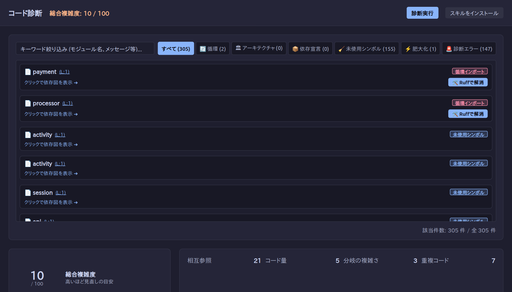

<!-- ai:draft created-at=2026-09-26T10:34:37Z agent=agy brief-sha256=f8d1016d6ffbbb934ee6171d66e53d2b99cf877b245377c3cc4a5acb3a3c12f5 -->
# コード診断を実行する

ModuleLoom の「コード診断」タブでは、プロジェクト全体の複雑度、モジュール肥大化、重複コード等の品質メトリクスを測定・確認できます。

## コード診断の実行

1. 上部のタブバーから「コード診断」を選択します。
2. 「診断実行」ボタンをクリックします。
3. プロジェクト全体のスコアおよび検出された問題（肥大化モジュール、重複箇所、循環インポート等）が一覧表示されます。

<!-- ai:generated id=diagnostics-screenshot kind=screenshot created-at=2026-09-26T12:44:43Z source-sha256=49d7cddec740b5965cbb752f9be57d8b4cba6104e6d0dac1d3e1deef5c98ea3a approved-at=2026-09-26T12:44:56Z -->

<!-- /ai:generated -->

## コーディングエージェントとの連携

<!-- ai:generated id=diagnostics-skill-install kind=text created-at=2026-09-26T11:28:23Z source-sha256=0aed97d3a92b30756bb3e765ec2533a979b5d9aa052c50effad8f76b5ba17c4b approved-at=2026-09-26T11:39:58Z -->
「コード診断」画面の「コード診断スキルをインストール」ボタンについて、実装に基づき説明します。

---

### 1. ボタンの概要と動作

- **UI 要素**:
  - **配置場所**: 「コード診断」タブ（ヘッダー:「コード診断」）
  - **ボタン表示名**: 「コード診断スキルをインストール」（`title`: `検出したコーディングエージェントにコード診断スキルをインストール`）
  - **隣接ボタン**: 「診断実行」（`title`: `現在のコードを診断して結果を更新`）
- **実行時の挙動**:
  - ボタンをクリックすると一時的にボタンが無効化（`disabled`）され、ステータス欄に「コード診断スキルをインストール中...」が表示されます。
  - バックエンド処理（Tauri コマンド `install_agent_skill` または CLI `analyze --install-skill`）を呼び出し、ローカル環境で検出されたコーディングエージェントの設定ディレクトリ配下へ専用のスキルファイルを自動配置します。
  - 完了後、エージェントごとの処理結果（インストール完了、既にインストール済み、保護などのメッセージ）が表示されます。※Web ブラウザ版では「スキルのインストールにはアプリ版が必要です」のエラーとなります。

---

### 2. 対象コーディングエージェントの検出仕様

ユーザーのホームディレクトリ（`HOME` または `USERPROFILE`）を基準に、以下の 3 種類のエージェントを検出します。

| エージェント名 | ルートディレクトリ | 検出条件 |
| :--- | :--- | :--- |
| **Codex** | 環境変数 `CODEX_HOME`（未設定時は `~/.codex`） | `CODEX_HOME` が指定されている、ルートディレクトリが存在する、または PATH 上に `codex` コマンドが存在する |
| **Claude Code** | `~/.claude` | `~/.claude` ディレクトリが存在する、または PATH 上に `claude` コマンドが存在する |
| **Cursor** | `~/.cursor` | `~/.cursor` ディレクトリが存在する、または PATH 上に `cursor` コマンドが存在する |

※いずれのエージェントも検出されなかった場合は「Codex、Claude Code、Cursor が見つかりませんでした」というエラーが返されます。

---

### 3. 追加されるスキルと仕様

- **スキル名**: `moduleloom-diagnostics`
- **配置先パス**: `<各エージェントのルートディレクトリ>/skills/moduleloom-diagnostics/SKILL.md`
- **既存ファイルの保護（安全性）**:
  - 既に同パスに同一内容のファイルが存在する場合は、新規書き込みを行わず「既にインストール済み」として報告されます。
  - 内容が異なる同名ファイルが存在する場合は上書きせず、「既存のスキルを保護しました」として既存の内容を保持します。

#### スキル（SKILL.md）の具体的な内容・機能
エージェントに対して、ModuleLoom のコード診断 CLI（`analyze` / `moduleloom-analyze`）を利用した Python コードの修正と再検証手順を指示します。

1. **CLI 診断の実行と証跡取得**:
   - `analyze --diagnostics --findings-only .` や `--rule 'ty/*'` 等のオプションを用いて、構造化された JSON 形式でプロジェクトの診断結果（指摘事項 `findings`、警告 `quality_warnings`）を取得する手順。
2. **指摘事項の精査**:
   - 指摘の `rule`, `severity`, `location`, `message`, `evidence`, `verification.recheck_rule` を確認した上で該当コードを把握し、`info` レベルの指摘（型アノテーション欠落など）はレビューのヒントとして扱う方針。
3. **コード修正と再検証（Edit and verify）**:
   - 単に警告を隠すためのルール抑制や閾値変更を行わず、ソースコード側で根本原因を解消すること。
   - 変更後は同一の CLI ルールを再実行して問題解消を確認し、既存のテストスイートや `ty`（`uv run ty check`）による整合性確認を行うこと。
   - 完了報告時には、実行コマンド、残存件数、検証結果、JSON ファイルのパスを明示すること。
<!-- /ai:generated -->
<!-- /ai:draft -->
