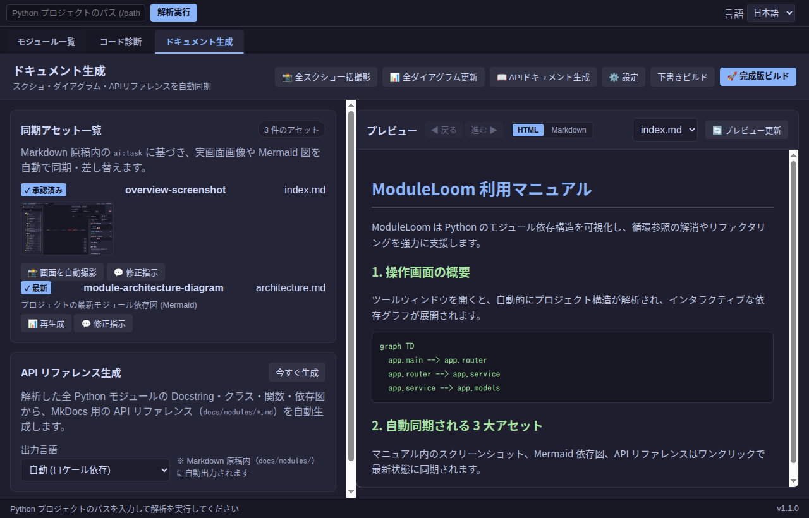
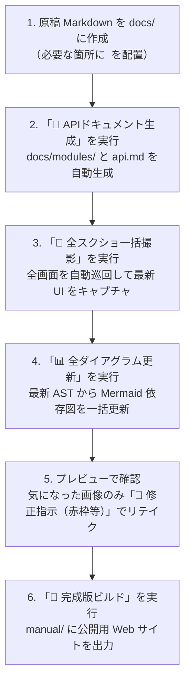
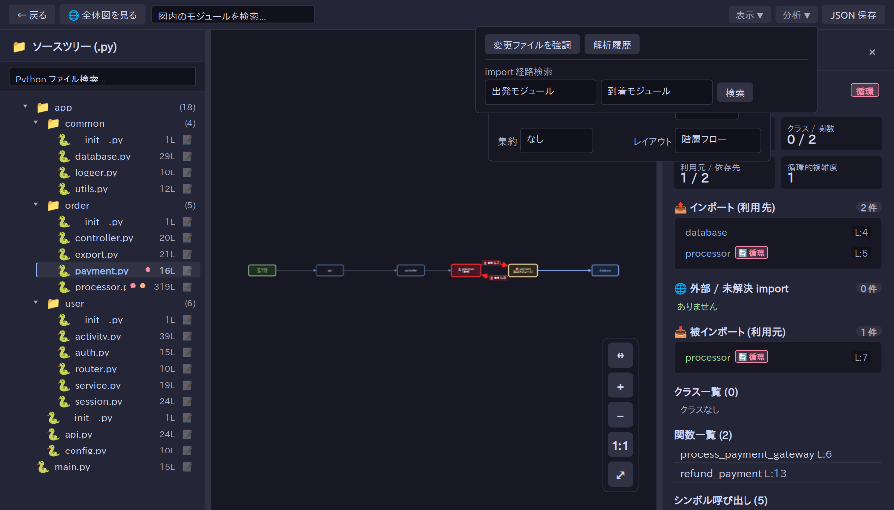

<!-- ai:draft created-at=2026-09-27T00:55:00Z agent=agy -->
# ドキュメント生成とプレビュー

ModuleLoom の「ドキュメント生成」は、手書きマニュアル内の **スクリーンショット・モジュール依存図（Mermaid）・API リファレンス** という、手作業での更新が最も負担となる **3 大アセットの自動同期・一括生成** に特化したハブ機能です。

文章や章立てなどの原稿 Markdown は、普段使いのコーディングエージェント（Agy, Claude, Cursor 等）や人間が自由に作成し、画像やダイアグラムの同期ポイントに `<!-- ai:task -->` を配置します。ModuleLoom が実画面の自動巡回撮影、AST 解析からの最新ダイアグラム生成、および Docstring からの API リファレンス出力をボタン 1 発で自動実行します。

---

## 1. 画面構成と 3 大アセット生成ツール

「ドキュメント生成」画面は、上部のアクションバー、左側の **アセット管理・生成パネル**、および右側の **リアルタイムプレビューパネル** で構成されています。

<!-- ai:generated id=manual-tab-screenshot kind=screenshot created-at=2026-09-26T12:44:44Z source-sha256=7574b42f657600b132c686eb0754078f900c330f17b6c33ef5dcbef7a9bf687a approved-at=2026-09-26T12:44:59Z -->

<!-- /ai:generated -->

### アクションバー（上部ヘッダー）

| ボタン | 機能と役割 |
| :--- | :--- |
| **📸 全スクショ一括撮影** | 全タブ（モジュール一覧・コード診断・マニュアル等）を自動巡回し、原稿内の全スクリーンショットを最新の実画面から一括再撮影・差し替えます。 |
| **📊 全ダイアグラム更新** | プロジェクトの最新 Python コード構造（AST）を解析し、原稿内の Mermaid モジュール依存図を一括自動再生成します。 |
| **📖 APIドキュメント生成** | 全 Python モジュールの Docstring・クラス・関数・型ヒントから、`docs/modules/*.md` および `docs/api.md` を一瞬で自動生成します。 |
| **⚙️ 設定** | HTML出力先（`manual/`）、Markdown原稿元（`docs/`）、AI CLI、MkDocsテーマなどを設定するポップアップを開きます。 |
| **下書きビルド** | 未撮影・未生成の箇所をプレースホルダーとして残したまま、最新の原稿から MkDocs 下書きサイトを高速ビルドします。 |
| **🚀 完成版ビルド** | アセットが揃っていることを検証し、公開・配布用の完全な静的 Web サイト（`manual/`）を出力します。 |

---

## 2. 3 大アセットの自動同期機能

### 1. スクリーンショット一覧プレビュー & リテイク
* **サムネイル一覧表示**:
  * 同期アセット一覧内の各スクショカードには、実際に撮影された最新画面のサムネイルが並びます。画像をクリックすると画面全体で拡大プレビューが可能です。
* **面倒な承認ポチポチの撤廃**:
  * 画像が存在していれば、個別の承認ボタンを押さなくてもそのまま完成版ビルドの対象になります。
  * プレビューを見て「撮り直したい」画像だけ、**「📸 画面を自動撮影」** や **「💬 修正指示」** を実行できます。
* **「このボタンに丸を囲んで」赤枠・赤丸ハイライト（アノテーション）**:
  * 修正指示欄に `#btn-manual-capture` や「全スクショ」「保存」などのボタン名・キーワードを入力して再撮影すると、対象要素の周囲に自動で**赤丸や角丸赤枠のハイライト**を合成してキャプチャします。

### 2. 最新 Mermaid モジュール依存図の自動更新
* 原稿内に `<!-- ai:task kind=diagram -->` を配置しておくだけで、**「📊 全ダイアグラム更新」** をクリックするたびに、コードベースの最新の依存関係を反映した Mermaid グラフへと一括置換されます。

### 3. Docstring からの API リファレンス自動生成
* **「📖 APIドキュメント生成」** を実行すると、プロジェクト内の全モジュールを走査し：
  * モジュールごとの詳細ページ（`docs/modules/0000.md`〜）: クラス、メソッド、関数、引数型、Docstring、個別 Mermaid 依存図
  * 全体 API カタログ（`docs/api.md`）: 全シンボルの目次と説明一覧
  を原稿ディレクトリ内に自動出力します。手書きのマニュアルページから自由にリンクして活用できます。

---

## 3. ドキュメント運用の基本フロー



1. **原稿の用意**:
   * コーディングエージェントやテキストエディタで `docs/index.md` や各操作ガイドを作成します。画面写真を入れたい場所に `<!-- ai:task id=main-ui kind=screenshot \nメイン画面\n-->`、依存図を入れたい場所に `<!-- ai:task id=mod-dep kind=diagram\nモジュール依存図\n-->` を置きます。
2. **API ドキュメントの生成**:
   * **「📖 APIドキュメント生成」** をクリックすると、最新コードの Docstring から API リファレンスが一瞬で生成されます。
3. **アセットの一括撮影・生成**:
   * **「📸 全スクショ一括撮影」** と **「📊 全ダイアグラム更新」** をクリックします。実画面のキャプチャと Mermaid 図が自動で差し込まれます。
4. **プレビューと微調整**:
   * 右側ペインのプレビューやサムネイルを確認します。特定のボタンを強調したい場合は、カードの「💬 修正指示」に `#btn-id を赤枠で囲んで` と入力してリテイク実行します。
5. **完成版ビルド**:
   * **「🚀 完成版ビルド」** を押せば、公開可能な MkDocs HTML サイトが `manual/` に出力されます。

---

## 4. UI 改修時の一括更新

UI デザインの変更や機能追加が行われた場合：

1. 最新のアプリを起動した状態で、**「📸 全スクショ一括撮影」** をクリックします。
2. ツールが全画面を自動巡回して全画像を最新状態に置き換えます。
3. 撮影完了と同時に下書きプレビューが自動更新されるため、確認後 **「🚀 完成版ビルド」** を押すだけでドキュメント更新が完了します。

---

## 5. AI タグの書き方とルール仕様

原稿 Markdown 内に埋め込む `<!-- ai:task -->` および生成される `<!-- ai:generated -->` タグの厳格な構文と運用ルールです。コーディングエージェントや人間が手書きでマニュアル原稿を作成する際は、必ず以下のルールに従ってください。

### 1. タスク指示タグの基本構文 (`ai:task`)

```markdown
&lt;!-- ai:task id=&lt;一意のID&gt; kind=&lt;screenshot|diagram|text&gt;
&lt;指示文 / プロンプト&gt;
--&gt;
```

* **`id` の命名規則**:
  * 小文字英字で始まり、小文字英数字とハイフンのみ使用可能（正規表現: `^[a-z][a-z0-9-]*$`）。
  * マニュアル全体（`docs/` 内の全 `.md` ファイル中）で**完全に一意（重複不可）**である必要があります。
  * 良い例: `overview-screenshot`, `module-architecture-diagram`, `setup-guide`
  * 悪い例: `1_screen`（数字始まり）, `main_UI`（大文字・アンダースコア）
* **`kind` の種別（3 種類のみ）**:
  * `screenshot`: 実画面のキャプチャ画像専用
  * `diagram`: Mermaid によるモジュール依存図専用
  * `text`: 文章、解説、手順、注釈専用
* **改行・フォーマットの厳格ルール**:
  * `<!-- ai:task ...` の直後は必ず改行して指示文を開始してください。
  * 指示文を記述した後、必ず改行して `-->` で閉じてください。
  * 指示文が空（空白のみ）のタグは構文エラーになります。

### 2. 単一責任の原則（Strict Separation）

各 `kind` の生成物は、その目的以外の不要な要素（注釈や出典、説明文）を含めてはなりません。

| 種別 | 生成・保持される内容 | 禁止事項・ルール |
| :--- | :--- | :--- |
| **`kind=screenshot`** | **純粋な画像 Markdown タグのみ**<br>`` | 画像タグの前後に説明文、注釈、キャプション、出典を含めることは禁止です。補足説明が必要な場合は、直前または直下に独立した `kind=text` タスクを配置してください。<br>※指示文に `#btn-id` などのセレクタや「全スクショ」等のボタン名を含めると、撮影時に自動で赤丸・赤枠ハイライトが合成されます。 |
| **`kind=diagram`** | **純粋な Mermaid コードブロックのみ**<br>````mermaid\n...\n```` | コードブロックの前後にタイトル、注記、出典フッターを含めることは禁止です。解説が必要な場合は独立した `kind=text` タスクを併置してください。 |
| **`kind=text`** | **純粋な Markdown 文章・手順・注釈専用** | 画像タグや Mermaid コードブロックを混在させず、純粋な説明文のみを記述・生成させます。 |

#### 配置例（単一責任を守った構成）
```markdown
### 画面操作手順

&lt;!-- ai:task id=step-operation-text kind=text
ツールウィンドウを開き、再解析ボタンをクリックする手順を説明してください
--&gt;

&lt;!-- ai:task id=btn-analyze-screenshot kind=screenshot
#btn-analyze を赤枠で囲んだ操作画面を撮影
--&gt;

&lt;!-- ai:task id=screenshot-caption-text kind=text
上のスクリーンショットに関する注意点（ショートカットキーなど）を簡潔に補足
--&gt;
```

### 3. スクリーンショットのアノテーション指示仕様（赤丸・角丸赤枠・矢印・説明文ラベル）

スクリーンショットタスクの指示文（プロンプト）または GUI の「💬 修正指示」に要素名やキーワード、アノテーション指示を含めることで、撮影時に自動で **赤丸・角丸赤枠**、**指示矢印**、および **吹き出し説明文ラベル** を合成できます。

```
       ┌─────────────────────────────────────┐
       │ 💬 1. ここをクリックして全スクショ更新 │  ← 吹き出し説明文ラベル（半透明ダーク背景・赤枠）
       └──────────────────┬──────────────────┘
                          ▼                         ← 指示矢印（赤色ハイライト）
                   ╭─────────────╮
                   │ 📸 全スクショ │                  ← 赤丸 または 角丸赤枠ハイライト
                   ╰─────────────╯
```

#### アノテーション指示の構文キーワード
| 指定項目 | 指示方法 | 動作仕様 |
| :--- | :--- | :--- |
| **対象要素** | `#btn-id`, `.class` またはボタン名<br>（例: `全スクショ`, `ダイアグラム`, `API`, `ビルド`, `保存`, `解析`, `診断`, `設定` 等） | 指定された ID/クラス、または自然言語のボタン名に一致する UI 要素を自動検出します。 |
| **ハイライト形状** | `丸`, `円`, `circle` を含む | **円形（赤丸）** で要素を包み込むようにハイライトします（指定がない場合はフィットする **角丸四角の赤枠**）。 |
| **指示矢印** | `矢印` または `arrow` を含む | 要素の直上（またはスペースに応じて直下）に **赤い指示矢印（`⬇` / `⬆`）** を合成します。 |
| **説明文ラベル** | `「...」`, `『...』`, `"..."`, `'...'`, または `説明: ...` | 赤枠・矢印と合わせて、ダーク半透明背景に赤枠の **吹き出し説明文ラベル** を自動配置します。 |

#### 実践的な活用例

* **活用例 1: 操作手順マニュアルで重要ボタンを赤枠・矢印・吹き出しで案内**
  ```markdown
  &lt;!-- ai:task id=step-batch-capture kind=screenshot
  #btn-manual-batch-capture を赤枠で囲み、矢印を付けて「1. ここをクリックして全スクショを一括更新」と説明
  --&gt;
  ```
  *効果*: ボタンが角丸赤枠で強調され、その真上に矢印と「1. ここをクリックして全スクショを一括更新」のラベルが付いた画像がワンクリックで撮影・保存されます。

* **活用例 2: 設定アイコンを赤丸と矢印で注目させる**
  ```markdown
  &lt;!-- ai:task id=settings-guidance kind=screenshot
  設定ボタンを赤丸と矢印で指して「出力先やAIモデルを変更」と説明
  --&gt;
  ```
  *効果*: 設定アイコンが綺麗な赤丸でマークされ、矢印と説明ラベルが付加されるため、読者が一目で操作場所を理解できます。

* **活用例 3: GUIの「💬 修正指示」からの即座リテイク**
  * ドキュメント生成カード内の「💬 修正指示」モーダルで：
    > 「保存ボタンを赤丸で囲み、矢印をつけて『変更をプロジェクトに保存』と説明文を入れて」
  * と入力して送信するだけで、指示通りのアノテーションが合成された新しい画像に即座に差し替わります。


### 4. 生成後タグ (`ai:generated`) とライフサイクル

タスクが実行されると、原稿内の `ai:task` が自動的に `ai:generated` タグで置き換わります：

```markdown
&lt;!-- ai:generated id=overview-screenshot kind=screenshot created-at=2026-09-27T00:00:00Z source-sha256=a1b2c3... approved-at=2026-09-27T00:05:00Z --&gt;

&lt;!-- /ai:generated --&gt;
```

* **`source-sha256` による追跡**:
  * 指示文（`kind` + 改行 + `prompt`）から算出された SHA-256 ハッシュ値が記録されます。
  * 原稿側の指示文が後から書き換えられた場合、ハッシュの不一致により自動的に「指示変更あり（stale）」と検知され、リテイクや再生成が促されます。
* **`approved-at`（承認日時）**:
  * 内容を確認して「承認」を行うと、承認日時がタグ内に記録され、全体再生成の際にも意図しない上書きから保護されます。
  * ただし、Mermaid ダイアグラム（`kind=diagram`）はコードの最新状態を優先するため、承認済みであっても「📊 全ダイアグラム更新」によって最新コード構造に同期されます。

### 5. ビルドモードによる検証ルールの違い

* **下書きビルド（`--draft`）**:
  * 未撮影・未生成の `ai:task` が原稿に残っていてもエラーになりません。
  * 生成待ちのブロックは、オレンジ色の「作成待ち（Pending）」プレースホルダーとして HTML 内に可視化され、全体の構成や進捗を確認できます。
* **完成版ビルド（厳格ビルド）**:
  * 原稿内のすべての `ai:task` に対応する実アセット（画像ファイル、Mermaid 図、文章）が揃っていることが必須です。
  * 未解決のタスクや、指示文が変更されて stale 状態のブロックが 1 つでも残っている場合はビルドが中断され、問題箇所がエラーとして報告されます。
<!-- /ai:draft -->
