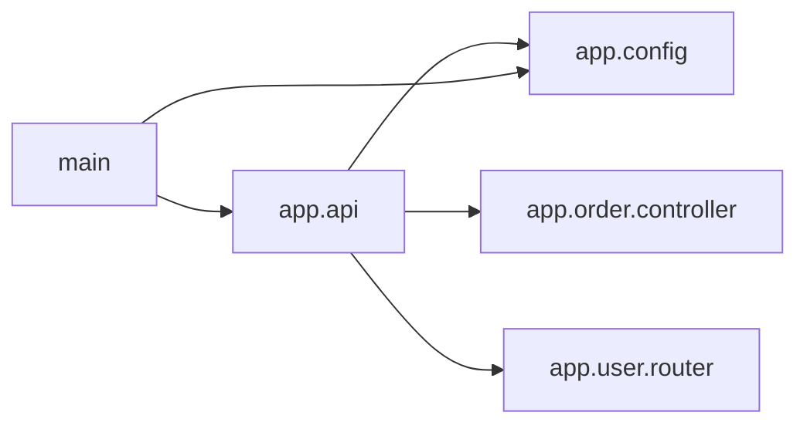

<!-- Generated by ModuleLoom. Edits will be replaced. -->

# app.api

[← 全体図](../index.md)

## 説明

Main API router aggregating User and Order subsystems.
Ideal module to test Focus Mode and 1-Hop dependency diagram.

### class `ApiServer`

説明はありません。

### ApiServer.__init__

`ApiServer.__init__(self)`

説明はありません。

### ApiServer.route_request

`ApiServer.route_request(self, path: str, method: str, data: dict)`

説明はありません。

### start_api_server

`start_api_server()`

説明はありません。

