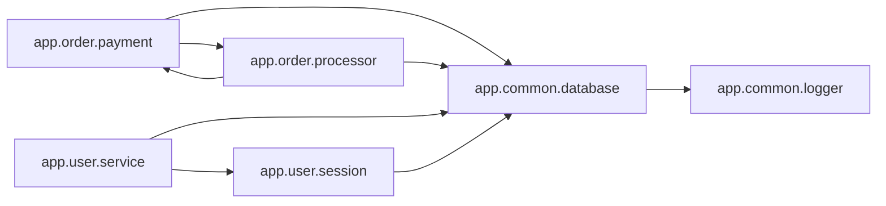

<!-- Generated by ModuleLoom. Edits will be replaced. -->

# app.common.database

[← 全体図](../index.md)

## 説明

Database connection and session pooling module.
This core module is widely imported across services, demonstrating inbound dependencies.

### class `DatabaseConnection`

説明はありません。

### DatabaseConnection.__init__

`DatabaseConnection.__init__(self, uri: str = 'sqlite:///sample.db')`

説明はありません。

### DatabaseConnection.connect

`DatabaseConnection.connect(self) -> None`

説明はありません。

### DatabaseConnection.execute_query

`DatabaseConnection.execute_query(self, query: str, params: dict = None) -> list`

説明はありません。

### DatabaseConnection.close

`DatabaseConnection.close(self) -> None`

説明はありません。

### get_db

`get_db() -> DatabaseConnection`

説明はありません。

