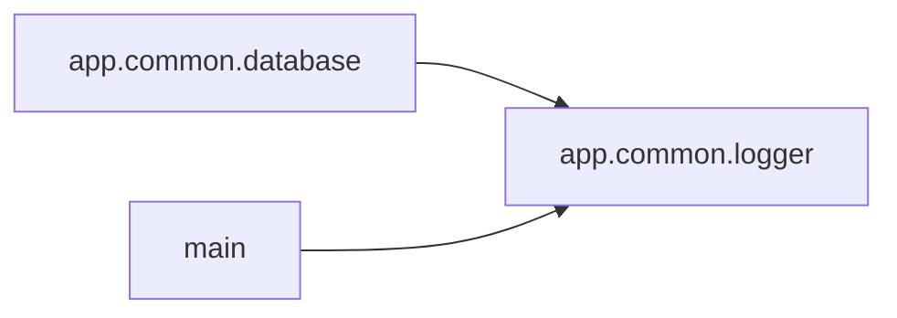

<!-- Generated by ModuleLoom. Edits will be replaced. -->

# app.common.logger

[← 全体図](../index.md)

## 説明

Common logger module.

### log_info

`log_info(message: str) -> None`

説明はありません。

### log_error

`log_error(message: str) -> None`

説明はありません。

