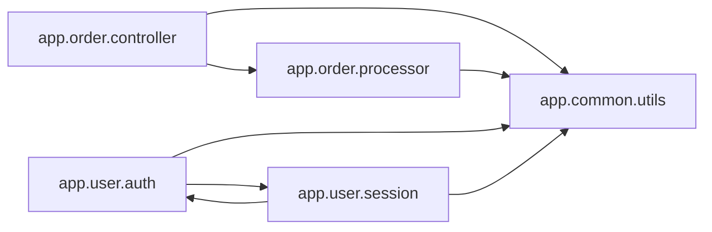

<!-- Generated by ModuleLoom. Edits will be replaced. -->

# app.common.utils

[← 全体図](../index.md)

## 説明

Common utility helpers.

### generate_uuid

`generate_uuid() -> str`

説明はありません。

### hash_password

`hash_password(plain_text: str) -> str`

説明はありません。

### format_currency

`format_currency(amount: float) -> str`

説明はありません。

