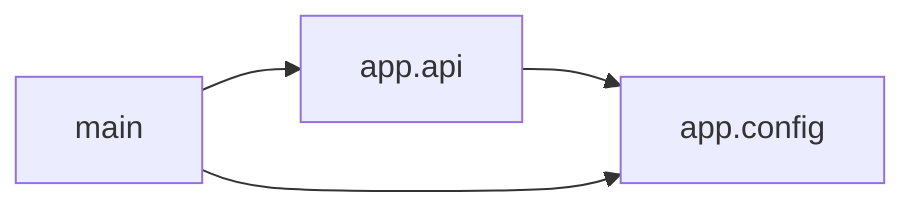

<!-- Generated by ModuleLoom. Edits will be replaced. -->

# app.config

[← 全体図](../index.md)

## 説明

Application configuration module.

### class `Config`

説明はありません。

### get_config

`get_config() -> Config`

説明はありません。

