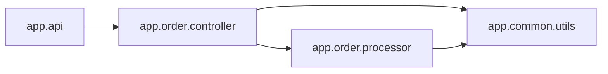

<!-- Generated by ModuleLoom. Edits will be replaced. -->

# app.order.controller

[← 全体図](../index.md)

## 説明

Order controller HTTP endpoints.
Demonstrates downstream circular import detection (processor <-> payment).

### handle_create_order

`handle_create_order(req)`

説明はありません。

