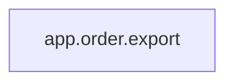

<!-- Generated by ModuleLoom. Edits will be replaced. -->

# app.order.export

[← 全体図](../index.md)

## 説明

注文と返金のCSV出力例。短いコピペ箇所の検出に使う。

### export_orders

`export_orders(rows: list[dict]) -> str`

説明はありません。

### export_refunds

`export_refunds(rows: list[dict]) -> str`

説明はありません。

