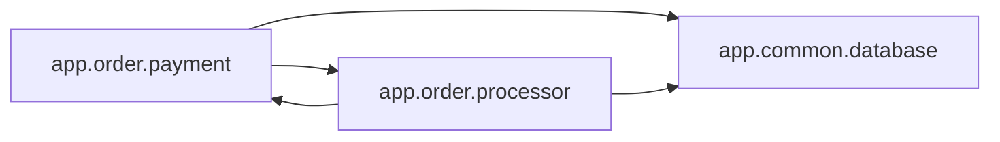

<!-- Generated by ModuleLoom. Edits will be replaced. -->

# app.order.payment

[← 全体図](../index.md)

## 説明

Payment processing gateway module.
Contains circular dependency with app.order.processor.

### process_payment_gateway

`process_payment_gateway(order_id: int, amount: float) -> bool`

説明はありません。

### refund_payment

`refund_payment(payment_id: int) -> bool`

説明はありません。

