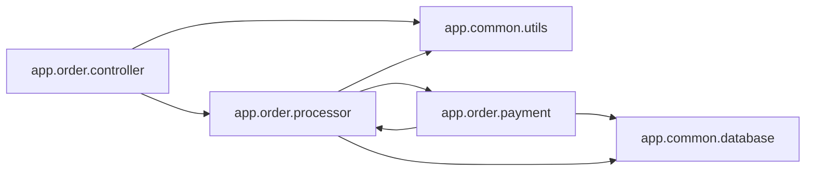

<!-- Generated by ModuleLoom. Edits will be replaced. -->

# app.order.processor

[← 全体図](../index.md)

## 説明

Order processing engine.
This module is deliberately oversized (> 300 LOC) to trigger bloat detection.
It also contains a circular import with app.order.payment.

### class `OrderItem`

説明はありません。

### OrderItem.__init__

`OrderItem.__init__(self, item_id: int, name: str, unit_price: float, quantity: int)`

説明はありません。

### OrderItem.subtotal

`OrderItem.subtotal(self) -> float`

説明はありません。

### class `OrderProcessor`

説明はありません。

### OrderProcessor.__init__

`OrderProcessor.__init__(self)`

説明はありません。

### OrderProcessor.calculate_tax

`OrderProcessor.calculate_tax(self, subtotal: float) -> float`

説明はありません。

### OrderProcessor.calculate_discount

`OrderProcessor.calculate_discount(self, subtotal: float, coupon_code: str = None) -> float`

説明はありません。

### OrderProcessor.calculate_shipping

`OrderProcessor.calculate_shipping(self, subtotal: float, region: str = 'tokyo') -> float`

説明はありません。

### OrderProcessor.validate_inventory

`OrderProcessor.validate_inventory(self, items: list) -> bool`

説明はありません。

### OrderProcessor.create_order

`OrderProcessor.create_order(self, customer_id: int, items: list, coupon: str = None) -> dict`

説明はありません。

### update_order_status

`update_order_status(order_id: int, new_status: str) -> None`

説明はありません。

### audit_order_step_1

`audit_order_step_1(order_id: int)`

説明はありません。

### audit_order_step_2

`audit_order_step_2(order_id: int)`

説明はありません。

### audit_order_step_3

`audit_order_step_3(order_id: int)`

説明はありません。

### audit_order_step_4

`audit_order_step_4(order_id: int)`

説明はありません。

### audit_order_step_5

`audit_order_step_5(order_id: int)`

説明はありません。

### audit_order_step_6

`audit_order_step_6(order_id: int)`

説明はありません。

### audit_order_step_7

`audit_order_step_7(order_id: int)`

説明はありません。

### audit_order_step_8

`audit_order_step_8(order_id: int)`

説明はありません。

### audit_order_step_9

`audit_order_step_9(order_id: int)`

説明はありません。

### audit_order_step_10

`audit_order_step_10(order_id: int)`

説明はありません。

### audit_order_step_11

`audit_order_step_11(order_id: int)`

説明はありません。

### audit_order_step_12

`audit_order_step_12(order_id: int)`

説明はありません。

### audit_order_step_13

`audit_order_step_13(order_id: int)`

説明はありません。

### audit_order_step_14

`audit_order_step_14(order_id: int)`

説明はありません。

### audit_order_step_15

`audit_order_step_15(order_id: int)`

説明はありません。

### audit_order_step_16

`audit_order_step_16(order_id: int)`

説明はありません。

### audit_order_step_17

`audit_order_step_17(order_id: int)`

説明はありません。

### audit_order_step_18

`audit_order_step_18(order_id: int)`

説明はありません。

### audit_order_step_19

`audit_order_step_19(order_id: int)`

説明はありません。

### audit_order_step_20

`audit_order_step_20(order_id: int)`

説明はありません。

### audit_order_step_21

`audit_order_step_21(order_id: int)`

説明はありません。

### audit_order_step_22

`audit_order_step_22(order_id: int)`

説明はありません。

### audit_order_step_23

`audit_order_step_23(order_id: int)`

説明はありません。

### audit_order_step_24

`audit_order_step_24(order_id: int)`

説明はありません。

### audit_order_step_25

`audit_order_step_25(order_id: int)`

説明はありません。

### check_item_batch_availability

`check_item_batch_availability(batch_id: str, quantity: int) -> bool`

説明はありません。

### lock_inventory_batch

`lock_inventory_batch(batch_id: str, quantity: int) -> bool`

説明はありません。

### release_inventory_batch

`release_inventory_batch(batch_id: str, quantity: int) -> bool`

説明はありません。

### sync_warehouse_status

`sync_warehouse_status(warehouse_id: str) -> dict`

説明はありません。

### calculate_handling_fees

`calculate_handling_fees(weight_kg: float) -> float`

説明はありません。

### generate_packaging_slip

`generate_packaging_slip(order_id: int) -> str`

説明はありません。

### verify_postal_code

`verify_postal_code(postal_code: str) -> bool`

説明はありません。

### estimate_delivery_date

`estimate_delivery_date(postal_code: str) -> str`

説明はありません。

### notify_shipping_carrier

`notify_shipping_carrier(tracking_number: str) -> bool`

説明はありません。

### notify_warehouse_dock

`notify_warehouse_dock(order_id: int) -> bool`

説明はありません。

### rule_engine_evaluate_01

`rule_engine_evaluate_01()`

説明はありません。

### rule_engine_evaluate_02

`rule_engine_evaluate_02()`

説明はありません。

### rule_engine_evaluate_03

`rule_engine_evaluate_03()`

説明はありません。

### rule_engine_evaluate_04

`rule_engine_evaluate_04()`

説明はありません。

### rule_engine_evaluate_05

`rule_engine_evaluate_05()`

説明はありません。

### rule_engine_evaluate_06

`rule_engine_evaluate_06()`

説明はありません。

### rule_engine_evaluate_07

`rule_engine_evaluate_07()`

説明はありません。

### rule_engine_evaluate_08

`rule_engine_evaluate_08()`

説明はありません。

### rule_engine_evaluate_09

`rule_engine_evaluate_09()`

説明はありません。

### rule_engine_evaluate_10

`rule_engine_evaluate_10()`

説明はありません。

### rule_engine_evaluate_11

`rule_engine_evaluate_11()`

説明はありません。

### rule_engine_evaluate_12

`rule_engine_evaluate_12()`

説明はありません。

### rule_engine_evaluate_13

`rule_engine_evaluate_13()`

説明はありません。

### rule_engine_evaluate_14

`rule_engine_evaluate_14()`

説明はありません。

### rule_engine_evaluate_15

`rule_engine_evaluate_15()`

説明はありません。

### rule_engine_evaluate_16

`rule_engine_evaluate_16()`

説明はありません。

### rule_engine_evaluate_17

`rule_engine_evaluate_17()`

説明はありません。

### rule_engine_evaluate_18

`rule_engine_evaluate_18()`

説明はありません。

### rule_engine_evaluate_19

`rule_engine_evaluate_19()`

説明はありません。

### rule_engine_evaluate_20

`rule_engine_evaluate_20()`

説明はありません。

### rule_engine_evaluate_21

`rule_engine_evaluate_21()`

説明はありません。

### rule_engine_evaluate_22

`rule_engine_evaluate_22()`

説明はありません。

### rule_engine_evaluate_23

`rule_engine_evaluate_23()`

説明はありません。

### rule_engine_evaluate_24

`rule_engine_evaluate_24()`

説明はありません。

### rule_engine_evaluate_25

`rule_engine_evaluate_25()`

説明はありません。

### rule_engine_evaluate_26

`rule_engine_evaluate_26()`

説明はありません。

### rule_engine_evaluate_27

`rule_engine_evaluate_27()`

説明はありません。

### rule_engine_evaluate_28

`rule_engine_evaluate_28()`

説明はありません。

### rule_engine_evaluate_29

`rule_engine_evaluate_29()`

説明はありません。

### rule_engine_evaluate_30

`rule_engine_evaluate_30()`

説明はありません。

### rule_engine_evaluate_31

`rule_engine_evaluate_31()`

説明はありません。

### rule_engine_evaluate_32

`rule_engine_evaluate_32()`

説明はありません。

### rule_engine_evaluate_33

`rule_engine_evaluate_33()`

説明はありません。

### rule_engine_evaluate_34

`rule_engine_evaluate_34()`

説明はありません。

### rule_engine_evaluate_35

`rule_engine_evaluate_35()`

説明はありません。

### rule_engine_evaluate_36

`rule_engine_evaluate_36()`

説明はありません。

### rule_engine_evaluate_37

`rule_engine_evaluate_37()`

説明はありません。

### rule_engine_evaluate_38

`rule_engine_evaluate_38()`

説明はありません。

### rule_engine_evaluate_39

`rule_engine_evaluate_39()`

説明はありません。

### rule_engine_evaluate_40

`rule_engine_evaluate_40()`

説明はありません。

### rule_engine_evaluate_41

`rule_engine_evaluate_41()`

説明はありません。

### rule_engine_evaluate_42

`rule_engine_evaluate_42()`

説明はありません。

### rule_engine_evaluate_43

`rule_engine_evaluate_43()`

説明はありません。

### rule_engine_evaluate_44

`rule_engine_evaluate_44()`

説明はありません。

### rule_engine_evaluate_45

`rule_engine_evaluate_45()`

説明はありません。

### rule_engine_evaluate_46

`rule_engine_evaluate_46()`

説明はありません。

### rule_engine_evaluate_47

`rule_engine_evaluate_47()`

説明はありません。

### rule_engine_evaluate_48

`rule_engine_evaluate_48()`

説明はありません。

### rule_engine_evaluate_49

`rule_engine_evaluate_49()`

説明はありません。

### rule_engine_evaluate_50

`rule_engine_evaluate_50()`

説明はありません。

### rule_engine_evaluate_51

`rule_engine_evaluate_51()`

説明はありません。

### rule_engine_evaluate_52

`rule_engine_evaluate_52()`

説明はありません。

### rule_engine_evaluate_53

`rule_engine_evaluate_53()`

説明はありません。

### rule_engine_evaluate_54

`rule_engine_evaluate_54()`

説明はありません。

### rule_engine_evaluate_55

`rule_engine_evaluate_55()`

説明はありません。

### rule_engine_evaluate_56

`rule_engine_evaluate_56()`

説明はありません。

### rule_engine_evaluate_57

`rule_engine_evaluate_57()`

説明はありません。

### rule_engine_evaluate_58

`rule_engine_evaluate_58()`

説明はありません。

### rule_engine_evaluate_59

`rule_engine_evaluate_59()`

説明はありません。

### rule_engine_evaluate_60

`rule_engine_evaluate_60()`

説明はありません。

### rule_engine_evaluate_61

`rule_engine_evaluate_61()`

説明はありません。

### rule_engine_evaluate_62

`rule_engine_evaluate_62()`

説明はありません。

### rule_engine_evaluate_63

`rule_engine_evaluate_63()`

説明はありません。

### rule_engine_evaluate_64

`rule_engine_evaluate_64()`

説明はありません。

### rule_engine_evaluate_65

`rule_engine_evaluate_65()`

説明はありません。

### rule_engine_evaluate_66

`rule_engine_evaluate_66()`

説明はありません。

### rule_engine_evaluate_67

`rule_engine_evaluate_67()`

説明はありません。

### rule_engine_evaluate_68

`rule_engine_evaluate_68()`

説明はありません。

### rule_engine_evaluate_69

`rule_engine_evaluate_69()`

説明はありません。

### rule_engine_evaluate_70

`rule_engine_evaluate_70()`

説明はありません。

### rule_engine_evaluate_71

`rule_engine_evaluate_71()`

説明はありません。

### rule_engine_evaluate_72

`rule_engine_evaluate_72()`

説明はありません。

### rule_engine_evaluate_73

`rule_engine_evaluate_73()`

説明はありません。

### rule_engine_evaluate_74

`rule_engine_evaluate_74()`

説明はありません。

### rule_engine_evaluate_75

`rule_engine_evaluate_75()`

説明はありません。

### rule_engine_evaluate_76

`rule_engine_evaluate_76()`

説明はありません。

### rule_engine_evaluate_77

`rule_engine_evaluate_77()`

説明はありません。

### rule_engine_evaluate_78

`rule_engine_evaluate_78()`

説明はありません。

### rule_engine_evaluate_79

`rule_engine_evaluate_79()`

説明はありません。

### rule_engine_evaluate_80

`rule_engine_evaluate_80()`

説明はありません。

### rule_engine_evaluate_81

`rule_engine_evaluate_81()`

説明はありません。

### rule_engine_evaluate_82

`rule_engine_evaluate_82()`

説明はありません。

### rule_engine_evaluate_83

`rule_engine_evaluate_83()`

説明はありません。

### rule_engine_evaluate_84

`rule_engine_evaluate_84()`

説明はありません。

### rule_engine_evaluate_85

`rule_engine_evaluate_85()`

説明はありません。

### rule_engine_evaluate_86

`rule_engine_evaluate_86()`

説明はありません。

### rule_engine_evaluate_87

`rule_engine_evaluate_87()`

説明はありません。

### rule_engine_evaluate_88

`rule_engine_evaluate_88()`

説明はありません。

### rule_engine_evaluate_89

`rule_engine_evaluate_89()`

説明はありません。

### rule_engine_evaluate_90

`rule_engine_evaluate_90()`

説明はありません。

### rule_engine_evaluate_91

`rule_engine_evaluate_91()`

説明はありません。

### rule_engine_evaluate_92

`rule_engine_evaluate_92()`

説明はありません。

### rule_engine_evaluate_93

`rule_engine_evaluate_93()`

説明はありません。

### rule_engine_evaluate_94

`rule_engine_evaluate_94()`

説明はありません。

### rule_engine_evaluate_95

`rule_engine_evaluate_95()`

説明はありません。

### rule_engine_evaluate_96

`rule_engine_evaluate_96()`

説明はありません。

### rule_engine_evaluate_97

`rule_engine_evaluate_97()`

説明はありません。

### rule_engine_evaluate_98

`rule_engine_evaluate_98()`

説明はありません。

### rule_engine_evaluate_99

`rule_engine_evaluate_99()`

説明はありません。

### rule_engine_evaluate_100

`rule_engine_evaluate_100()`

説明はありません。

### compliance_check_gdpr

`compliance_check_gdpr()`

説明はありません。

### compliance_check_pci_dss

`compliance_check_pci_dss()`

説明はありません。

### compliance_check_tax_report

`compliance_check_tax_report()`

説明はありません。

### compliance_check_iso27001

`compliance_check_iso27001()`

説明はありません。

### compliance_check_soc2

`compliance_check_soc2()`

説明はありません。

### compliance_check_local_regulations

`compliance_check_local_regulations()`

説明はありません。

### compliance_check_data_retention

`compliance_check_data_retention()`

説明はありません。

### compliance_check_export_restrictions

`compliance_check_export_restrictions()`

説明はありません。

### compliance_check_fraud_indicators

`compliance_check_fraud_indicators()`

説明はありません。

### compliance_check_ip_blacklist

`compliance_check_ip_blacklist()`

説明はありません。

