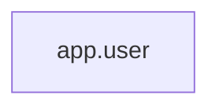

<!-- Generated by ModuleLoom. Edits will be replaced. -->

# app.user

```mermaid
flowchart LR
  n0["app.user"]
  click n0 href "0012.html" "モジュールページを開く"
```

[← 全体図](../index.md)

## 説明

モジュールの説明はありません。

