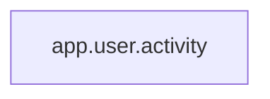

<!-- Generated by ModuleLoom. Edits will be replaced. -->

# app.user.activity

[← 全体図](../index.md)

## 説明

利用履歴の集計例。共通関数化できる長い重複を含む。

### summarize_logins

`summarize_logins(events: list[dict]) -> dict`

説明はありません。

### summarize_sessions

`summarize_sessions(events: list[dict]) -> dict`

説明はありません。

