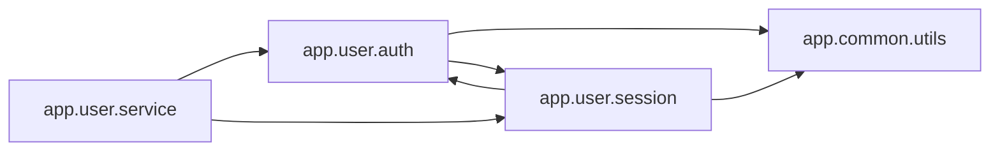

<!-- Generated by ModuleLoom. Edits will be replaced. -->

# app.user.auth

[← 全体図](../index.md)

## 説明

User authentication service.
Demonstrates resolving circular imports via function-level (deferred / 遅延インポート) import.

### authenticate_user

`authenticate_user(username: str, password_hash: str) -> bool`

説明はありません。

### verify_auth_token

`verify_auth_token(token: str) -> bool`

説明はありません。

