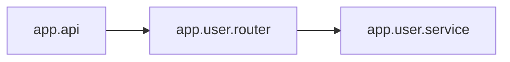

<!-- Generated by ModuleLoom. Edits will be replaced. -->

# app.user.router

[← 全体図](../index.md)

## 説明

User HTTP routing endpoints.

### handle_login

`handle_login(req)`

説明はありません。

### handle_get_user

`handle_get_user(user_id: int)`

説明はありません。

