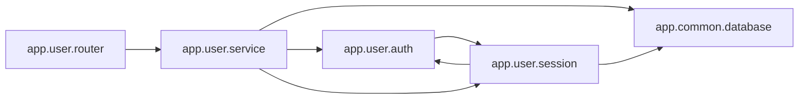

<!-- Generated by ModuleLoom. Edits will be replaced. -->

# app.user.service

[← 全体図](../index.md)

## 説明

User domain service.
Imports app.user.auth, demonstrating downstream circular dependency detection.
Also imports app.common.database.

### class `UserService`

説明はありません。

### UserService.__init__

`UserService.__init__(self)`

説明はありません。

### UserService.login

`UserService.login(self, username: str, password_hash: str)`

説明はありません。

### UserService.get_profile

`UserService.get_profile(self, user_id: int)`

説明はありません。

