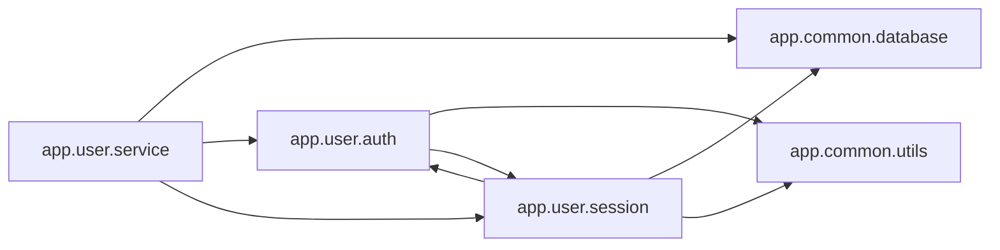

<!-- Generated by ModuleLoom. Edits will be replaced. -->

# app.user.session

[← 全体図](../index.md)

## 説明

Session management module.
Contains circular dependency with app.user.auth.
Also imports app.common.database.

### create_session

`create_session(user_id: int) -> str`

説明はありません。

### get_active_session

`get_active_session(username: str)`

説明はありません。

### validate_session

`validate_session(token: str) -> bool`

説明はありません。

