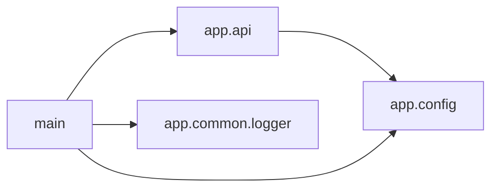

<!-- Generated by ModuleLoom. Edits will be replaced. -->

# main

```mermaid
flowchart LR
  n0["app.api"]
  n1["app.common.logger"]
  n2["app.config"]
  n3["main"]
  n0 --> n2
  n3 --> n0
  n3 --> n1
  n3 --> n2
  click n0 href "0001.html" "モジュールページを開く"
  click n1 href "0004.html" "モジュールページを開く"
  click n2 href "0006.html" "モジュールページを開く"
  click n3 href "0018.html" "モジュールページを開く"
```

[← 全体図](../index.md)

## 説明

Application entry point.
Imports top-level API and configuration.

### main

`main()`

説明はありません。

