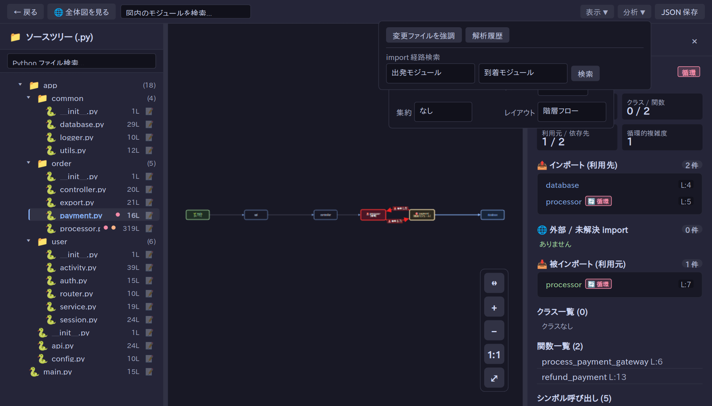

<!-- ai:draft created-at=2026-09-26T10:34:37Z agent=agy brief-sha256=f8d1016d6ffbbb934ee6171d66e53d2b99cf877b245377c3cc4a5acb3a3c12f5 -->
# ツールウィンドウを開く

ModuleLoom を PyCharm 上で起動して対象プロジェクトの解析を開始する手順です。

## ツールウィンドウの起動

<!-- ai:generated id=pycharm-open-tool-window kind=text created-at=2026-09-26T11:30:09Z source-sha256=f7ee08c5be5833c932c950e96e839f385bfd564e05d993949f9353cc0ea52352 approved-at=2026-09-26T11:40:17Z -->
PyCharm で ModuleLoom のツールウィンドウを開くには、以下のいずれかの手順を実行します。

### 1. 右側ツールバーから開く
- PyCharm ウィンドウ右側のツールウィンドウバーにある **ModuleLoom** アイコンをクリックします。
- メインメニューの **表示** (View) → **ツールウィンドウ** (Tool Windows) → **ModuleLoom** から開くことも可能です。

### 2. プロジェクトビューのコンテキストメニューから開く
- プロジェクトビュー上で対象のディレクトリまたは Python ファイル（`.py`）を右クリックします。
- コンテキストメニューの「**ModuleLoom で開く**」を選択します。
  - ディレクトリ選択時: 「**ModuleLoom で解析: <ディレクトリ名>**」と表示され、ツールウィンドウが開いて該当ディレクトリの解析が実行されます。
  - Python ファイル選択時: 「**ModuleLoom で依存図を開く: <ファイル名>**」と表示され、ツールウィンドウが開いて対象モジュールの依存図が表示されます。

### 3. エディタのコンテキストメニューから開く
- 開いている Python ファイルのエディタ領域、または上部のエディタタブを右クリックします。
- コンテキストメニューから「**ModuleLoom で開く**」（「**ModuleLoom で依存図を開く: <ファイル名>**」）を選択すると、ツールウィンドウが開き、対象ファイルの依存関係ダイアグラムが表示されます。

---

> **連動機能（ダブルクリック連動）**  
> ツールウィンドウ上の「**ダブルクリック連動**」チェックボックスがオン（デフォルト有効）の場合、PyCharm 側で Python ファイルをダブルクリックして開くだけで、ModuleLoom も自動的に連動して対象ファイルの依存図を表示します。
<!-- /ai:generated -->

## 解析対象の設定と実行

1. ModuleLoom ツールウィンドウ上部の「対象設定 ▸」をクリックして設定パネルを展開します。
2. 「プロジェクトパス」に対象の Python プロジェクトのディレクトリを指定するか、「参照…」ボタンから選択します（対象プロジェクトがドロップダウンにある場合は「解析対象」から選択することも可能です）。
3. 「解析実行」ボタンをクリックすると、プロジェクトの解析が実行され、モジュール一覧および依存図が表示されます。

<!-- ai:generated id=tool-window-settings-screenshot kind=screenshot created-at=2026-09-26T12:44:46Z source-sha256=3f26a35a25f8a44822a305bc7615d82ad0ea3dc35fe076a7ec70906de3964c70 approved-at=2026-09-26T12:45:05Z -->

<!-- /ai:generated -->
<!-- /ai:draft -->
